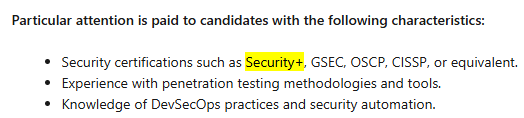

I passed the SecurityX exam last week after about three months of training and I want to share some thoughts about the CAS-005 exam, about my previous CompTIA certifications (Security+, PenTest+, as well as CySA+) and a general review of whether it was worth it as a whole.

<!-- markdownlint-capture -->
<!-- markdownlint-disable -->
> This blog post has been entirely written by hand, and not generated by AI.
{.prompt-info }
<!-- markdownlint-restore -->

## My experience prior to passing SecurityX 💼

I've been in the IT industry for nearly eight years, five of them in cybersecurity; about a year and a half as a blue teamer, and three and a half years in vulnerability management. I earned a couple of certifications during that period, notably Security+, PenTest+, CySA+, as well as OSCP and AWS Security Specialty more recently. Since then, I went back to school to pursue my master's degree. All in all, especially in my current position, I've had the opportunity to work in multiple areas related to cybersecurity, but also IT in general. All of this helped me prepare for this exam.

## How I prepared for all CompTIA exams 📖

I used to be a big fan of Udemy to find everything I needed to pass CompTIA certifications, from [Mike Meyers (Total Seminars)](https://www.udemy.com/user/total_seminars/) to now [Jason Dion's courses](https://www.udemy.com/user/jason-dion/), as well as [practice exams](https://www.udemy.com/courses/search/?q=compTIA+practice+exams). It was cheap and effective: the video courses covered a lot of content that was directly applicable to the Security+ exam and the practice exams were truly a great preparation tool to pass the exam with ease. I strongly recommend using Udemy content to prepare for Security+.

However, for PenTest+ and CySA+, the Udemy courses felt more like a review of what you are supposed to know. On the bright side, the courses did assume that you had prior cybersecurity knowledge and didn't start from the surface level concepts. While the practice exams were educational enough to sufficiently test the knowledge that could be included in the exam, they felt somewhat underwhelming, especially when facing those Performance-Based Questions (PBQs) that started to be more challenging. Particularly for the CySA+ exam, some of the PBQs were especially complex, and hands-on work experience (and even CTFs) greatly helped me answer these questions. Some of the questions you get are easy enough; others take real effort, and that's where past experience comes in handy.

As for SecurityX, the video courses were simply a reminder of all of the acronyms you are supposed to already know. At least, if you watch Dion's courses, you can always find some neat discounts at the end of the course if you decide to buy an exam attempt (or two if you opt for the retake insurance, which is worth it at that price IMO). As for the practice exams, the questions were about the same difficulty as those in the [AWS CSS exam](https://aws.amazon.com/certification/certified-security-specialty/): they are almost entirely situation-based or scenario-based, while you'll only get a few questions about how a specific technology works. For the Udemy practice exams I took (from Jason Dion), the 6 sets of 90 questions were solid enough to be worth taking the time needed to master every question. While some questions were challenging enough to be helpful for the SecurityX exam, I was quite disappointed when I realized that the questions in my exam were a notch harder than what I had in my practice exams. More on that later...

To elaborate on the [SecurityX practice exams by Jason Dion](https://www.udemy.com/course/comptia-securityx-cas-005-6-practice-exams), while the 90% suggested passing score is really high, we don't know for sure what the current passing score is to clear the SecurityX exam. We can use the PenTest+ and CySA+ passing score as a reference, which is 750 out of 900, or about 83-85% to be safe. While the score is weighted depending on the difficulty of the exam, we can take a reasonable guess that the SecurityX passing score is near that number. At the same time, the difference between 83% and 90% is about one error every 6 questions versus one error every 10 questions, which makes any mistakes almost twice as punishing when we think about it. In my case, I simply assumed that the passing grade was 90% and went along with it.

<!-- markdownlint-capture -->
<!-- markdownlint-disable -->
> Before paying for any CompTIA exams, take a blind practice set as a self-assessment. If you're landing around 65-70% only on your current knowledge, you've got a solid enough base to start grinding toward the real exam. If you're below that, keep building fundamentals from the videos first. 
{.prompt-tip }
<!-- markdownlint-restore -->

## The exam: how was it? 📝

First things first, a little context: since I live in Quebec and the exam is not offered online in French, it is _not_ possible to take it online or from home. I therefore had to take it in person, either in another Canadian province or in the U.S. So, I booked my exam at the nearest testing center in Canada, chose the last available time slot (at around 12:30 PM), and started my day with a three-hour drive to the testing center in Ontario. Fatigue was already setting in, and I hadn't even started the exam yet... In any case, it's a small thing to consider before taking an exam. Ideally, it's a small thing to consider _**before buying**_ a non-refundable and a non-exchangeable exam attempt... Anyway, I arrived at the test center in one piece, completed the paperwork, was sent to a private room, and once I was settled, the exam began.

While the maximum number of questions you could have in your exam is 90, I had 78 during my attempt. With a time limit of 165 minutes, I did feel like I had a lot of time to answer everything and have some extra minutes to review some of my answers. When we take a step back, 78 questions is 13% *fewer* than what was initially expected, which can also be a grim reminder that the upcoming questions were more likely to be hard than easy. You also need to know that some questions aren't graded; they're there for quality control, but you don't know how many there are, or which ones they are, so you can't really rely on those questions to "_mentally cope_" whenever you doubt some of your answers during your attempt. At this point, you just need to consider all questions as if they all count towards the final grade and disregard the fact that it could be an ungraded question for QA purposes.

Normally, I used to skip the PBQs and come back to do them later, as I was told in the past that they weren't worth that many more points than the simple MCQs. However, to my surprise, in this exam, you are _**forced**_ to take them first, since you can't "technically" come back to do them later. In other words, some _do_ let you return to do them later, but you'll lose all progress on that question. In fact, I had one PBQ that I just couldn't skip, or else it would have been evaluated as is. I do not know how many points they were worth, but they did test my past experience to solve them, and my previous certifications outside of CompTIA truly gave me a hand there for the more practical things (not to say that Security+, PenTest+ and CySA+ were useless, but you now understand why the previous name of SecurityX was CompTIA Advanced Security **Practitioner** / CASP+). All in all, I completed all PBQs in about 30 minutes, making sure that everything was right before moving on to the next questions and the rest of the exam.

The first time I looked at the timer, I had about 70 questions to do in about two hours, which seemed like plenty of time. However, if you've already taken the AWS Security Specialty exam, you know that some questions are ridiculously long to read, and that the answers are just as long. A thing that was a literal game changer during my exam was that I could bring a transparent reusable water bottle with me. This small detail helped me get through my exam attempt more easily, since the water bottle allowed me to stay focused on the exam instead of being stressed for a thousand and one reasons, like being dehydrated. Since I took the exam in person, I could also take a short bathroom break, which was a great nice-to-have. At one point during my exam, I stumbled across a couple of acronyms I'd never seen before. The only thing I could do was solve them by elimination, trusting my intuition and choosing the answer that seemed the most logical. Unless you obtain more information later during the exam about that acronym, assume that it won't happen and trust your instinct. Time passes. Do you?

Later on, on some questions, I was completely clueless, as it was not my strongest domain of expertise and all the possible answers looked the same or had very little difference between them. In that case, just answer whatever feels right and move on. The reason why you shouldn't take too much time on questions that you aren't sure about is that time passes way faster than you'd imagine. By the time I'd answered every question, I only had a little bit less than 10 minutes to review about... 13-14 questions. While I did doubt whether I'd pass the exam, I stayed focused until the end, reviewed all of those questions and surprisingly, I managed to clarify some of them, leaving me with around 8 questions I still wasn't sure about. With less than 5 minutes to go, I simply decided to end my exam.

Not even five minutes later, the receptionist had already printed a document confirming that I had passed the exam. I was pleasantly surprised by the speed of the process: for all my previous CompTIA exams, validation always took a little less than 24 hours, but this time, it happened almost instantly. We'll take it!

{ width="490" height="478" caption="The SecurityX score report"}

## Back at work: what's the payoff? 📊

The first thing my boss asked me about this certification after I passed it was: "How would it positively affect your current role?" and to be honest, passing it humbled me more than I imagined. It felt like I was practising to be a team lead, where you need to answer every question thrown at you by anyone, and have almost all the answers right away. While you have multiple choices of answers during the exam, you don't have that IRL: you need to find it for yourself and it was a realization for me that I might not be ready _yet_ to move on to a leadership position. However, it did make me realize that almost all businesses try to solve the same complicated problems as you do, which is quite eye-opening if you take a step back. Now, with the exam behind me, I feel like I know where the industry is headed, where my employer stands, and what I need to do to make good decisions to ultimately make progress and positive changes.

## Which certifications felt more rewarding? 🏅

This is a really good question and the answer is... (_drum roll please_ 🥁🥁🥁): ||it depends on your situation||. I know it's a bit of a cliché, but the answer will vary greatly depending on your background, your current expertise, and what you're aiming for in the short term. _Any™_ certification can redefine your career if it fulfills your needs perfectly, just like it can be absolutely useless (and spoiler alert: ||it's most likely the latter||). Here are some explanations and personal anecdotes to elaborate on my view:

<!-- markdownlint-capture -->
<!-- markdownlint-disable -->
> The answers provided here reflect my personal experience and opinions. I encourage you, dear readers, to consider other perspectives before deciding whether any of the following CompTIA certifications are worth your time or not.
{.prompt-warning }
<!-- markdownlint-restore -->

### Security+
If you want to get your very first job in IT, Security+ will certainly add a small *plus* (no pun intended) to your portfolio. Does it guarantee you a job in cyber? Not at all. Does it guarantee you an entry-level job in IT? No, but it will clearly help you stand out from the crowd of junior staff or recent graduates. Like anything in life, it's always good to stack the odds in your favour when an opportunity arises, and with a little more luck, you might get a chance that others won't, simply because you've demonstrated that you've voluntarily invested in yourself (both in money and time). Another cool thing about the Security+ certification is that it is commonly used in job postings, alongside CEH, CISA and CISSP, among others. In other words, the fact that Security+ is listed alongside these more demanding certifications indirectly contributes to inflating the value of the certification, or at least improving its perceived value in the eyes of recruiters.

{ width="490" height="478" caption="An example of a job posting on LinkedIn mentioning Security+"}

For me, I took it right after finishing my college degree and shortly before starting my first year for my bachelor's degree. Security+ was also my very first professional certification outside of school, and its difficulty was just right for my needs 👌. I had learned enough in college before starting this certification to retain the training material quickly, and it made my first year of university much easier. The new material I learned from the certification was then explored more thoroughly in my university classes, which made the certification a great summer project before going back to school.

However, while it is still recognized in the market, its added value basically stops there for Security+: it is a certification for entry-level roles, it might allow you to bypass HR in certain cases, and that's about it. A friend of mine who wanted to get his first job in cybersecurity went for an interview at a defence company, and the first question his interviewer asked him was: "Do you have Security+? If not, come back later when you have it." Although he still managed to get a cybersecurity job elsewhere _without Security+_, not having the certification didn't prevent him from successfully completing the hiring process for an entry-level position. In fact, it was his homelab project and his connections/plugs that made him stand out from the crowd and landed him a job in the field. In short, if you're a young student trying to break into IT, it might be worth considering and the benefits are there. The certification helped me out when I started my career in IT, so it can surely help you too in the short term. Other than that, the certification won't add much value to your career, especially in the long run. The certification answers the question: "Do you know the basic principles of cybersecurity well enough?", and it highlights that holders of this certification know the field at a high level and some keywords, so they will not be completely lost when they start their first job in cyber (or IT).

### CySA+
CySA+ is quite a step-up from Security+ in terms of difficulty and personally, I dig it. I took it after two years of cyber experience working in a SOC and it was a great way to test my knowledge in the field in general. I was doing my bachelor's degree at the same time, and it was just the right difficulty to be a good review of everything I had seen in school up to that point, as well as new concepts I could use for my job at the time. While it may not be as recognized as other more technical certifications, it was good enough to be worth doing and there are some job postings on LinkedIn that mention it (meaning that it has its purpose). All in all, the certification is the answer to the following question: "Do you know how a SOC works? Prove it" and it was a good review to evaluate if you do understand how cybersecurity works on a broader level.

### PenTest+
However, I cannot say that for PenTest+. While the course content was interesting to learn about new tools and tricks, the exam is mostly knowledge-based with MCQs, which is not the mantra of offensive security (which is to be hands-on). It's not for nothing that CEH has such a poor reputation, even if it's recognized in the market. While the courses for this certification on Udemy can help someone get started with offsec, it is hard for me to recommend this certification to anyone, given that more practical alternatives targeted at a more junior audience exist, such as eJPT or CRTP. Ultimately, OSCP is the pentester's standard and after passing it, I do understand why employers ask for this one. Even though I had difficulty passing it, it is only a "base" difficulty for pentesting. These days, most employers expect you to test web applications, so if you want something cheap and that is relevant, BSCP might be a good option to consider as well.

### SecurityX
I took SecurityX mainly to renew all my previous CompTIA certifications in one go, and to test myself against the _8–10 years of experience recommended_ for the exam, just to see if it was true (spoiler: ||it kind of was||). Another fact to consider is that SecurityX is well ranked in [Paul Jerimy's security certification roadmap](https://pauljerimy.com/security-certification-roadmap/) (even if the roadmap is starting to show its age) and that the exam is more oriented towards the practical side of security rather than the management side of security. My biggest criticism of this exam is: why do SecurityX when you can do CISSP? According to a coworker who passed it recently, the questions are about the same difficulty, and besides the higher question count, you need to answer questions from the perspective of an "outsider", such as an auditor or a director. If you can pass SecurityX, you could technically pass CISSP with only a little extra work and effort. However, as you probably already know, CISSP is one of the most recognized certifications you can have in cybersecurity, if not _the_ most. While it doesn't actually test your practical skills, it has so much recognition that you simply cannot neglect it. If CISSP didn't exist, then sure: SecurityX would have some weight in the industry. Right now, that's not the case, and I do honestly find it unfortunate. The certification will certainly challenge your knowledge and experiences, especially the PBQs (which I enjoyed). If you're unsure whether you could pass CISSP, this certification is a great benchmark and if you have to fulfil a DoD baseline certification requirement, then go for it. Otherwise, its use is fairly limited.

## Was it all worth it? 🤔

Personally, when I started taking the CompTIA certifications, I thought that if I had them all, I would make a good six-figure salary, and the article I saw back then genuinely convinced me of that. However, as I got older, I realized that these people who had all these certifications didn't have great salaries because of their alphabet soup of acronyms, but because they had more than 10 or 15 years of experience under their belt. In other words, **they are paid for their experience**, and the certification is only used to support their work experience. For me, it was a nice learning journey, which led me to get some promotions here and there, and eventually a new job on the more offensive side of security. 

However, as I got more experience, certifications started to have diminishing returns, and I needed to demonstrate my skills elsewhere, either with projects, homelabs, blogs (such as this one), research or community contributions. Chasing certifications is undeniably good, but you must figure out where you want to be in the near future. Sure, SecurityX won't help me get a role in Red Teaming, but it might reinforce my current role to then pivot into something else related, maybe in security architecture or engineering. I've also come to realize that time is a finite resource: as you get older, you don't have as much of it as you did when you were younger to do all the certifications you wanted to do. You need to focus on those that are more relevant and to generally do increasingly more difficult certifications to deepen your knowledge. 

In addition, it is unwise to do certifications for the sake of doing certifications: if your dream job doesn't mention the certification you are aiming for or you can't find the added value of a certification for your future dream role, then maybe it is not the right certification for you. Your time and your money are valuable: make them count on your own terms. Everyone's path and preferences are different, so adapt your training to what you actually value. For me, the four CompTIA certifications I took were about 50/50 in terms of value: some of them genuinely gave me the boost I needed to kickstart my career, while others felt more like a chore to complete for the sole reason that I wanted the ultimate stackable certification, whatever that means. In the end, it is better to go for certifications that are in demand from recruiters, since the return is _somewhat_ guaranteed (your mileage may vary a lot, but it's still there). And on the plus side, certifications can become a nice little decoration in your office.

<!-- markdownlint-capture -->
<!-- markdownlint-disable -->
> Look at the jobs you want to strive for and take note of the certifications employers ask for in the requirements, then invest in those. It's not rocket science: it's computer science 🧠
{.prompt-tip }
<!-- markdownlint-restore -->

## TL;DR 🎯

SecurityX was challenging, personally rewarding since I ultimately got the CSIE, but no headhunter has sent me a DM on LinkedIn since I got it. If you need to renew your CompTIA certifications, this is quite the challenge and it's a nice step-up from more intermediate certifications like CySA+ or PenTest+, and it's considerably harder than Security+. The PBQs were really fun and overall, I do respect people who have passed the exam. Ultimately, knowing I helped someone make a more informed decision about whether these certifications are worthwhile, and where to best invest their time was all I needed to make the journey worth it.

Thank you for taking the time to read all of this. I hope you learned a thing or two about the certification and CompTIA's cybersecurity path through my personal journey. I also hope that this blog post helped you have a clearer insight into what it offers and whether you should obtain it or not.

{ width="647" height="500" caption="The CSIE certificate"}