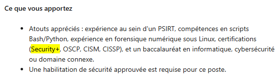

J'ai passé l'examen SecurityX la semaine dernière après environ trois mois de préparation, et je veux partager quelques réflexions sur l'examen CAS-005, sur mes certifications CompTIA précédentes (Security+, PenTest+, ainsi que CySA+) et faire un bilan général pour savoir si tout ça en valait vraiment la peine ou non.

<!-- markdownlint-capture -->
<!-- markdownlint-disable -->
> Ce blog a été écrit entièrement à la main et n'a pas été généré par l'IA.
{.prompt-info }
<!-- markdownlint-restore -->

## Mon expérience avant de réussir SecurityX 💼

Ça fait bientôt huit ans que je travaille dans le domaine des TI, dont cinq en cybersécurité; environ un an et demi comme _blue teamer_ et trois ans et demi en gestion des vulnérabilités. J'ai décroché quelques certifications entre-temps, comme Security+, PenTest+, CySA+, ainsi que l'OSCP et le Security Specialty d'AWS plus récemment. Depuis, je suis retourné aux études pour faire ma maîtrise. Bref, surtout dans mon poste actuel, j'ai eu la chance de travailler dans plusieurs domaines liés à la cybersécurité, mais aussi dans les TI en général. Tout ça m'a grandement aidé à me préparer pour cet examen.

## Ce que j'ai utilisé comme préparation pour réussir tous les examens CompTIA 📖

J'étais un grand fan d'Udemy pour trouver tout ce qu'il me fallait pour passer les certifications de CompTIA, que ce soit les cours de [Mike Meyers](https://www.udemy.com/user/total_seminars/) ou ceux de [Jason Dion](https://www.udemy.com/user/jason-dion/), ainsi que leurs [examens pratiques](https://www.udemy.com/courses/search/?q=compTIA+practice+exams). C'était abordable, le contenu vidéo des cours était directement applicable à la préparation de Security+, et les examens pratiques étaient étroitement reliés à ce qu'il y avait dans le vrai examen. Je recommande fortement le contenu Udemy pour se préparer à l'examen de Security+.

Toutefois, pour PenTest+ et CySA+, les cours Udemy ressemblaient plus à une révision de ce qu'on est déjà censé savoir, ce qui n'est pas nécessairement une mauvaise chose. Dès le départ, les cours présumaient que les connaissances de base en cybersécurité étaient acquises et assez bien maîtrisées. Même s'il y avait du déjà-vu ou du contenu un peu plus "de base", ce n'était souvent que sommaire. Bien que les examens pratiques aient été pertinents pour réussir les examens, les questions étaient un peu plus du côté facile que celles retrouvées dans les vrais examens. Autrement dit, les examens pratiques manquaient un peu de profondeur pour certaines questions plus poussées, surtout en préparation pour les PBQ (_Performance-Based Questions_) des vrais examens. Notamment pour l'examen de CySA+, certaines des PBQ étaient particulièrement complexes, et l'expérience de travail _hands-on_ (et même les CTF) m'a grandement aidé à répondre à ces questions. Certaines questions sont assez faciles, mais d'autres vont te demander un vrai effort, et c'est là que ton expérience va te sauver.

Concernant SecurityX, les cours sur Udemy n'étaient eux aussi qu'un simple rappel des acronymes qu'on est déjà censé savoir. Au moins, avec les cours de Dion, il y a généralement des rabais intéressants à la fin pour l'achat d'une tentative d'examen (ou deux tentatives avec l'assurance de reprise qui, à ce prix-là, mérite d'être considérée). Quant aux examens pratiques, j'ai pris ceux de Jason Dion encore une fois et le niveau de difficulté des questions était semblable à celui de [l'examen AWS CSS](https://aws.amazon.com/certification/certified-security-specialty/): elles sont presque toutes basées sur des situations ou des scénarios, et seulement quelques questions portent sur le fonctionnement d'une technologie spécifique. Ceci étant dit, les 6 séries de 90 questions étaient suffisamment solides pour me former et pour justifier le temps consacré à maîtriser chaque question. Par contre, même s'il y avait certaines questions qui étaient assez difficiles pour m'avoir été utiles à l'examen SecurityX, j'ai été pas mal déçu de constater que les questions de mon examen SecurityX étaient une bonne coche plus difficile que celles de mes examens pratiques. J'y reviendrai plus tard…

Pour élaborer sur [les examens pratiques SecurityX de Jason Dion](https://www.udemy.com/course/comptia-securityx-cas-005-6-practice-exams), bien que le score de passage suggéré de 90% soit excessivement élevé, on ne peut pas savoir avec certitude quelle est la note de passage actuelle pour SecurityX. On peut se fier aux notes de passage de PenTest+ et CySA+ comme référence, soit 750 sur 900, ou environ 83% à 85% pour être prudent. Bien que le score soit pondéré en fonction de la difficulté de l'examen (score dynamique), on peut raisonnablement supposer que la note de passage de SecurityX se situe près de ces chiffres-là. Quand on y pense, la différence entre 83% et 90% représente environ une erreur à chaque 6 questions, comparativement à une erreur à chaque 10 questions, ce qui rend chaque erreur presque deux fois plus pénalisante. Pour ma part, j'ai simplement présumé que la note de passage était de 90% et je m'en suis servi comme _cue_ pour savoir où j'en étais dans ma progression.

<!-- markdownlint-capture -->
<!-- markdownlint-disable -->
> Avant de payer pour un examen CompTIA, fais une autoévaluation en essayant un examen pratique à l'aveugle (ou en bon français, essaie de _striker_ un examen pratique). Si tu obtiens environ 65-70% uniquement avec tes connaissances actuelles et sans connaître les questions d'avance, tu as une base assez solide pour commencer à t'entraîner sérieusement en vue de passer le vrai examen. Si tu es en dessous de ça, continue de bâtir tes fondations en regardant les vidéos en premier.
{.prompt-tip }
<!-- markdownlint-restore -->

## L'examen: c'était comment? 📝

Tout d'abord, un peu de contexte: puisque j'habite au Québec et que l'examen n'est pas offert en ligne dans la langue française, il m'était impossible de faire l'examen à distance ou de chez nous. Je devais donc le faire en personne, soit dans une autre province canadienne, soit aux États-Unis. J'ai donc réservé mon examen au centre de test le plus proche au Canada, choisi la dernière heure disponible (vers 12h30) et débuté ma journée avec un petit trois heures de route jusqu'au centre d'examen en Ontario. La fatigue commençait déjà à se faire sentir, et je n'avais même pas encore commencé l'examen... Dans tous les cas, c'est une petite chose à considérer avant de passer un examen. Idéalement, c'est une petite chose à considérer _**avant d'acheter**_ une tentative d'examen non remboursable ni échangeable... Bref, j'arrive sur place au centre de test en un morceau, complète la paperasse, on m'envoie dans une salle privée et une fois installé, l'examen commence.

Bien que le nombre maximal de questions que tu peux avoir à l'examen est de 90, j'en ai eu 78 lors de ma tentative. Avec une limite de temps de 165 minutes, je me suis dit que j'allais avoir amplement de temps pour répondre à tout, avoir quelques minutes supplémentaires pour réviser certaines de mes réponses et garder un peu de lousse avant de tout soumettre. En prenant un peu de recul, 78 questions, c'est 13% de *moins* que ce qui était initialement prévu. C'est également une petite indication que les questions à venir allaient fort probablement être plus du côté difficile que facile. Il faut aussi savoir qu'il y a des questions qui ne sont pas notées à des fins de contrôle de qualité (_QA_), mais on ne sait ni combien il y en a, ni lesquelles. Alors, lorsque tu doutes de certaines de tes réponses pendant ta tentative, tu ne peux pas vraiment te fier à ces questions pour faire de la gymnastique intellectuelle et te dire que « 🌈ça va bien aller🌈 ». Rendu là, il suffit de considérer toutes les questions comme si elles comptaient toutes pour la note finale et de ne pas tenir compte du fait qu'il pourrait s'agir d'une question non notée à des fins de QA.

Normalement, j'avais l'habitude de sauter les PBQ et d'y revenir plus tard, puisqu'on m'avait dit dans le passé qu'elles ne valaient pas tellement plus de points que les simples questions à choix multiples. Toutefois, à ma grande surprise, dans cet examen, tu es _**forcé**_ de les faire en premier, puisque tu ne peux pas "techniquement" y revenir plus tard. Autrement dit, certaines questions PBQ te permettent d'y revenir ultérieurement, mais tu perdras tout ton progrès sur cette question-là. En effet, j'ai eu une PBQ que je ne pouvais tout simplement pas _skipper_, sinon elle aurait été évaluée telle quelle. Je ne sais pas combien de points elles valaient, mais elles ont quand même bien mis à l'épreuve mon expérience passée pour les résoudre correctement, et mes certifications précédentes en dehors de CompTIA m'ont donné un grand coup de main pour les aspects plus pratiques (pas pour dire que Security+, PenTest+ et CySA+ étaient inutiles, mais ce n'est pas pour rien que l'ancien nom de SecurityX était CompTIA Advanced Security **Practitioner** / CASP+). En tout et pour tout, j'ai complété toutes les PBQ en environ 30 minutes, en m'assurant que tout était correct avant de passer aux questions suivantes et au reste de l'examen.

La première fois que j'ai regardé l'heure, il me restait environ 70 questions à faire en à peu près deux heures, ce qui semblait être amplement de temps. Cependant, si tu as déjà fait l'examen AWS Security Specialty, tu sais que certaines questions sont ridiculement longues à lire, et que les réponses le sont tout autant. Une chose qui a littéralement changé la donne pendant mon examen, c'est que je pouvais apporter une bouteille d'eau réutilisable transparente avec moi. Ce petit détail m'a permis de mieux passer à travers ma tentative d'examen, puisque la bouteille d'eau m'a permis de rester concentré sur l'examen au lieu d'être stressé pour mille et une raisons, comme être déshydraté. Puisque j'ai fait l'examen en personne, il était également possible de prendre une petite pause pour aller aux toilettes, ce qui était bien agréable à avoir. Au courant de l'examen, je suis tombé sur quelques acronymes dont je ne connaissais pas la signification. La seule chose que je pouvais faire, c'était de les résoudre par élimination, en me fiant à mon intuition et en choisissant la réponse qui me semblait la plus logique. À moins d'obtenir plus d'information sur cet acronyme plus tard pendant l'examen, présume que ça n'arrivera pas et fais simplement confiance à ton instinct. Le temps passe. Et toi?

Un peu plus tard, sur certaines questions, j'étais complètement perdu, car ce n'était pas mon domaine d'expertise le plus fort et toutes les réponses possibles se ressemblaient ou avaient très peu de différences entre elles. Dans ce cas, réponds simplement ce qui te semble juste et passe à la suite. La raison pour laquelle tu ne devrais pas prendre trop de temps sur les questions dont tu n'es pas certain, c'est que le temps passe pas mal plus vite qu'on pourrait l'imaginer. Au moment où j'ai répondu à toutes les questions, il me restait un peu moins de 10 minutes pour réviser environ... 13-14 questions. Bien que j'aie douté de moi et de mes chances de réussir l'examen, je suis resté concentré jusqu'à la fin, j'ai révisé toutes ces questions et, étonnamment, j'ai réussi à en clarifier quelques-unes, me laissant avec environ 8 questions dont je n'étais toujours pas certain de la réponse. À moins de 5 minutes de la fin, j'ai simplement décidé de mettre fin à mon examen.

Même pas 5 minutes plus tard, la réceptionniste avait déjà imprimé un document confirmant ma réussite de l'examen. J'ai été agréablement surpris par la rapidité du processus: pour tous mes précédents examens CompTIA, la validation prenait toujours un peu moins de 24 heures, mais là, c'était quasiment instantané. On va le prendre!

{ width="490" height="478" caption="Le relevé de notes SecurityX"}

## De retour au travail: quelle est la plus-value? 📊

La première chose que mon patron m'a dite à propos de cette certification après ma réussite a été: « En quoi cela affecterait-il positivement ton rôle actuel? » et pour être honnête, la réussir m'a rendu plus humble que je ne l'imaginais. J'avais l'impression de me pratiquer à devenir un chef d'équipe, où tu dois répondre à toutes les questions qui te sont posées par n'importe qui et où tu dois avoir *presque* toutes les réponses sur-le-champ. Bien que tu aies plusieurs choix de réponses pendant l'examen, tu n'as pas ça dans la vraie vie: tu dois les trouver par toi-même et j'ai réalisé que je n'étais peut-être pas encore prêt à passer à un poste de leadership. Cependant, ça m'a fait réaliser que presque toutes les entreprises tentent de résoudre les mêmes problèmes compliqués que toi, ce qui est assez révélateur quand on prend du recul. Maintenant, avec l'examen derrière moi, j'ai l'impression de savoir où en est notre industrie, où se situe mon employeur et ce que je dois faire pour prendre de bonnes décisions afin d'ultimement progresser et d'apporter des changements positifs.

## Quelles certifications ont été les plus gratifiantes? 🏅

C'est une bonne question et la réponse est... (_roulement de tambour_ 🥁🥁🥁): ||ça dépend de ta situation||. Je sais que c'est un peu cliché, mais la réponse va grandement varier dépendamment de ton parcours, de ton expertise actuelle et de ce que tu vises à court terme. _N'importe quelle™_ certification peut propulser ta carrière si elle répond parfaitement à tes besoins, tout comme elle peut t'être absolument inutile (et _spoiler alert_: ||c'est probablement la seconde option||). Voici quelques explications et quelques anecdotes personnelles pour appuyer mes propos.

<!-- markdownlint-capture -->
<!-- markdownlint-disable -->
> Les réponses fournies ici reflètent mon expérience et mes opinions personnelles. Je t'encourage, cher lecteur, à consulter d'autres points de vue avant de décider si l'une des certifications CompTIA suivantes mérite ton temps ou non.
{.prompt-warning }
<!-- markdownlint-restore -->

### Security+
Si tu veux décrocher ta première job en TI, Security+ ajoutera sans aucun doute un petit *plus* (désolé pour le jeu de mots) à ton portfolio. Est-ce que ça te garantit une job en cyber? Pas du tout. Est-ce que ça te garantit une job _entry-level_ en TI? Non plus, mais ça va assurément t'aider à te démarquer du lot parmi les autres juniors ou les étudiants récemment diplômés. Comme toute chose dans la vie, il est toujours bon de mettre les chances de son bord quand l'occasion se présente, et avec un peu plus de chance, tu auras peut-être une occasion que d'autres n'auront pas, simplement grâce au fait que tu as démontré que tu as volontairement investi en toi-même (autant en argent qu'en temps). Un autre avantage de la certification Security+ est qu'elle est fréquemment mentionnée dans les offres d'emploi, aux côtés des certifications CEH, CISA et CISSP, entre autres. Autrement dit, le fait que Security+ se retrouve aux côtés de ces certifications plus exigeantes contribue indirectement à gonfler la valeur de la certification, ou du moins à améliorer sa valeur perçue aux yeux des recruteurs.

{ width="490" height="478" caption="Un extrait d'une offre d'emploi retrouvée sur LinkedIn mentionnant Security+"}

Pour ma part, je l'ai obtenu juste après avoir terminé mes études collégiales et juste avant d'entamer ma première année d'études universitaires au Bacc. Security+ était également ma toute première certification professionnelle hors du cadre scolaire, et son niveau de difficulté était parfaitement adapté à mes besoins 👌. J'avais acquis suffisamment de connaissances au Cégep avant de commencer cette certification pour pouvoir retenir rapidement les informations de la formation, ce qui a grandement facilité ma première année d'université. Les nouvelles notions apprises grâce à la certification ont ensuite été approfondies dans mes cours d'université, faisant de cette certification un excellent projet d'été avant de retourner aux études.

Cependant, bien qu'elle soit toujours reconnue sur le marché, la plus-value s'arrête essentiellement là pour Security+: c'est une certification qui est surtout considérée pour des rôles _entry-level_, ça peut te permettre de contourner les RH dans certains cas et c'est à peu près tout. Un de mes amis qui voulait obtenir sa première job en cybersécurité est allé passer une entrevue dans une entreprise de défense et la première question qu'il s'est fait poser par son intervieweur était: « As-tu Security+? Sinon, reviens plus tard quand tu l'auras ». Bien qu'il ait tout de même obtenu une job en cybersécurité ailleurs _sans Security+_, le fait de ne pas avoir la certification ne l'a pas empêché de réussir le processus d'embauche pour un poste de premier échelon. En fait, c'est son projet de *homelab* et ses connexions/contacts qui lui ont permis de se démarquer et de décrocher une job dans le domaine. Bref, si tu es un jeune étudiant qui essaie de percer dans le domaine TI, ça peut valoir la peine de le considérer et les bénéfices existent. La certification m'a été utile dans mes débuts de carrière en TI, donc elle peut certainement t'aider aussi à court terme. Autre que ça, la certification n'apportera pas tant plus de valeur que ça à ta carrière, surtout sur le long terme. La certification vient répondre à la question: « Connais-tu assez bien les principes de base de la cybersécurité? », et elle vient mettre en évidence que les détenteurs de cette certification connaissent le domaine à haut niveau et quelques mots clés, donc ils ne seront pas complètement perdus lors de leur première job en cyber (ou en TI).

### CySA+
CySA+ est clairement une coche au-dessus de Security+ en termes de difficulté et personnellement, je l'ai bien appréciée. Je l'ai obtenue après deux ans d'expérience en cybersécurité au sein d'un SOC et c'était une excellente façon de tester mes connaissances générales dans le domaine. Je faisais mon baccalauréat en même temps, et c'était juste le bon niveau de difficulté pour réviser efficacement tout ce que j'avais vu à l'université, tout en abordant de nouveaux concepts applicables à mon travail de l'époque. Bien qu'elle ne soit pas aussi reconnue que d'autres certifications plus techniques, elle vaut largement la peine d'être obtenue, et on la retrouve d'ailleurs dans certaines offres d'emploi sur LinkedIn (ce qui prouve son utilité). En tout, cette certification répond à la question: « Sais-tu comment fonctionne un SOC? Démontre-le », et c'était une bonne révision afin d'évaluer sa compréhension globale du domaine de la cybersécurité.

### PenTest+
Toutefois, je ne peux pas en dire autant de PenTest+. Bien que le contenu du cours ait été intéressant pour découvrir de nouveaux outils, l'examen est principalement basé sur les connaissances avec des questions à choix multiples, ce qui n'a rien à voir avec la philosophie de la sécurité offensive (qui est d'être très _hands-on_). Ce n'est pas pour rien que CEH a une mauvaise réputation, même si elle est reconnue sur le marché. Bien que les cours pour cette certification sur Udemy puissent aider quelqu'un à débuter en sécurité offensive, il m'est difficile de recommander cette certification à qui que ce soit, d'autant plus que d'autres alternatives plus pratiques destinées à un public plus junior existent, comme eJPT ou CRTP. Ultimement, l'OSCP est le standard pour être pentesteur et après l'avoir réussi, je comprends pourquoi les employeurs le demandent. Même si j'ai eu de la difficulté à le réussir, ce n'est qu'une difficulté "de base" pour le pentest. De nos jours, la plupart des employeurs s'attendent à ce que tu testes des applications Web, alors si tu veux quelque chose d'abordable et de pertinent, la certification BSCP pourrait être une bonne option à considérer.

### SecurityX
J'ai fait SecurityX principalement pour renouveler toutes mes certifications CompTIA précédentes d'un seul coup, ainsi que pour tester mes compétences face aux _8 à 10 ans d'expérience recommandés_ pour l'examen, juste pour voir si c'était vrai (spoiler: ||c'était pas mal le cas||). Un autre fait à considérer est que SecurityX est bien classée dans le [_roadmap_ des certifications en sécurité de Paul Jerimy](https://pauljerimy.com/security-certification-roadmap/) (même si le _roadmap_ commence à devenir désuet) et que l'examen est davantage orienté vers le côté pratique de la sécurité plutôt que le côté gestion. La plus grande critique que j'ai envers cet examen est: pourquoi faire SecurityX quand on peut faire CISSP? Après avoir discuté avec mon collègue qui l'a réussie récemment, les questions sont à peu près du même niveau de difficulté et, mis à part le nombre plus élevé de questions, il suffit de répondre aux questions du point de vue d'une personne "externe" ou un peu plus loin de l'action, comme un auditeur ou un directeur. Si tu peux réussir SecurityX, tu pourrais techniquement réussir CISSP seulement avec un peu plus d'étude et d'effort. Cependant, comme tu le sais probablement déjà, CISSP est l'une des certifications les plus reconnues (pour ne pas dire la plus reconnue) que tu peux avoir en cybersécurité. Bien qu'elle ne teste pas vraiment tes compétences pratiques, elle a tellement de reconnaissance qu'on ne peut tout simplement pas la négliger. Si CISSP n'existait pas, alors oui: SecurityX aurait un certain poids dans l'industrie. Actuellement, ce n'est pas le cas, et je trouve ça honnêtement dommage. La certification met certainement tes connaissances et tes expériences à l'épreuve, particulièrement les PBQ (que j'ai appréciées). Si tu doutes de ta capacité à réussir l'examen pour CISSP, cette certification est un excellent point de référence et si tu dois satisfaire une exigence de certification de base du DoD, alors SecurityX serait une option à considérer. Sinon, son utilité est plutôt limitée.

## Est-ce que ça en valait la peine? 🤔

Personnellement, quand j'ai commencé à faire les certifications CompTIA, je pensais que si je les avais toutes, je gagnerais un beau gros salaire à six chiffres, et l'article que j'avais vu à l'époque m'en avait vraiment convaincu. Cependant, avec le temps, j'ai réalisé que ces gens qui avaient toutes ces certifications n'avaient pas un excellent salaire grâce à leur soupe à l'alphabet d'acronymes de certifications, mais parce qu'ils avaient plus de 10 ou 15 ans d'expérience derrière eux. Autrement dit, **ils sont payés pour leur expérience**, et la certification ne sert qu'à appuyer leur expérience de travail. Pour moi, ce fut un beau parcours d'apprentissage, qui m'a mené à obtenir quelques promotions ici et là, et éventuellement un nouveau rôle vers le côté plus offensif de la sécurité.

Pourtant, au fur et à mesure que j'acquérais de l'expérience, les certifications ont commencé à avoir des rendements décroissants, et je devais démontrer mes compétences ailleurs, que ce soit avec des projets, des _homelabs_, des blogs (comme celui-ci), de la recherche ou des contributions à la communauté. Courir après les certifications, c'est certainement bien, mais tu dois déterminer où tu veux être dans un avenir rapproché. Bien sûr, SecurityX ne m'aidera pas à obtenir un rôle en _Red Team_, mais elle pourrait renforcer mon rôle actuel pour ensuite pivoter vers quelque chose de connexe, peut-être en architecture ou en ingénierie de la sécurité. On réalise aussi que le temps est une ressource limitée et qu'en vieillissant, on n'a plus autant de temps qu'avant pour faire toutes les certifications qu'on voulait faire. Il faut se concentrer sur celles qui sont les plus pertinentes et généralement faire des certifications de plus en plus difficiles pour approfondir ses connaissances.

## TL;DR 🎯

SecurityX a été un défi, personnellement gratifiant puisque j'ai finalement obtenu la certification cumulative CSIE, mais aucun chasseur de têtes ne m'a écrit sur LinkedIn depuis que je l'ai obtenu. Si tu dois renouveler des certifications CompTIA, c'est un beau défi et c'est un bon cran au-dessus des certifications plus intermédiaires comme CySA+ ou PenTest+, et elle est considérablement plus difficile que Security+. Les PBQ étaient vraiment amusantes et dans l'ensemble, j'ai du respect pour les gens qui ont réussi l'examen. Ultimement, savoir que j'ai aidé quelqu'un à prendre une décision plus éclairée à savoir si ces certifications en valent la peine, et où investir au mieux son temps, c'était tout ce qu'il me fallait pour que le parcours en vaille la peine.

Merci d'avoir pris le temps de lire tout ça. J'espère que tu as appris une chose ou deux sur la certification et le parcours en cybersécurité de CompTIA à travers mon cheminement personnel. J'espère aussi que ce blog t'a aidé à avoir une vision plus claire de ce que la certification offre et si tu devrais l'obtenir ou non.

{ width="647" height="500" caption="Le certificat CSIE"}