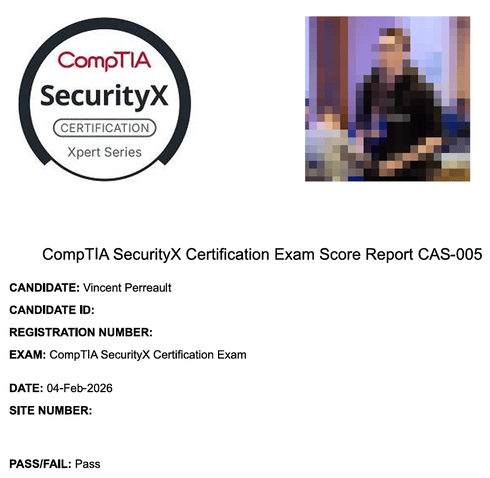
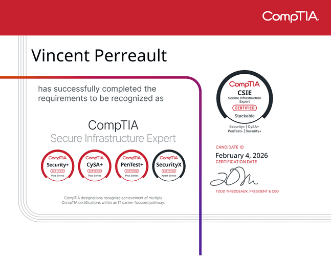

J'ai passé l'examen SecurityX la semaine dernière après environ trois mois de préparation, et je voulais partager quelques réflexions sur l'examen CAS-005, sur mes certifications CompTIA précédentes (Security+, PenTest+, ainsi que CySA+) et faire un bilan général pour savoir si tout ça en valait vraiment la peine ou non.

<!-- markdownlint-capture -->
<!-- markdownlint-disable -->
> Ce blog a été écrit entièrement à la main et n'a pas été généré par l'IA.
{.prompt-info }
<!-- markdownlint-restore -->

## Mon expérience avant de réussir SecurityX 💼

Ça fait bientôt huit ans que je travaille dans le domaine des TI, dont cinq en cybersécurité; environ un an et demi comme blueteamer et trois ans et demi en gestion des vulnérabilités. J'ai décroché quelques certifications entre temps, comme Security+, PenTest+, CySA+, ainsi que l'OSCP et le Security Specialty d'AWS plus récemment. Depuis, je suis retourné aux études pour faire ma maîtrise. Bref, surtout dans mon poste actuel, j'ai eu la chance de travailler dans plusieurs domaines liés à la cybersécurité, mais aussi dans les TI en général. Tout ça m'a grandement aidé à me préparer pour cet examen.

## Ce que j'ai utilisé comme préparation pour réussir tous les examens CompTIA 📖

J'étais un grand fan d'Udemy pour trouver tout ce qu'il me fallait pour passer les certifications de CompTIA, que ce soit les cours de [Mike Meyers](https://www.udemy.com/user/total_seminars/) ou ceux de [Jason Dion](https://www.udemy.com/user/jason-dion/), ainsi que leurs [examens pratiques](https://www.udemy.com/courses/search/?q=compTIA+practice+exams). C'était abordable, le contenu vidéo des cours était directement applicable à la préparation de Security+, et les examens pratiques étaient étroitement relié à ce qui avaient dans le vrai examen. Je recommande définitivement le contenu Udemy pour se préparer à l'examen de Security+.

Toutefois, pour PenTest+ et CySA+, les cours Udemy ressemblaient plus à une révision de ce qu'on est déjà censé savoir, ce qui n'est pas nécessairement une mauvaise chose. Dès le départ, les cours assumaient déjà les connaissances de base en cybersécurité étaient connues et quand même assez bien maitrisés. Même s'il y avait du déjà-vu ou du contenu un peu plus "de base", ce n'était souvent que sommaire. Bien que les examens pratiques aient été pertinents pour réussir les examens, les questions étaient un peu plus du côté facile que celles retrouvées dans les vrais examens. Autrement dit, les examens pratiques manquaient un peu de profondeur pour certaines questions plus poussées, surtout en préparation pour les PBQs des vrais examens. Notamment pour l'examen de CySA+, certaines des PBQs étaient particulièrement complexes, et l'expérience de travail _hands-on_ (et même les CTFs) sont grandement venus aider à répondre à ces questions. Bref, l'essentiel reste que les pratiques d'examen étaient primordiales à la réussite de PenTest+ et CySA+.

Pour élaborer sur [les examens pratiques SecurityX de Jason Dion](https://www.udemy.com/course/comptia-securityx-cas-005-6-practice-exams), bien que le score de passage suggéré de 90% soit excessivement élevé, on ne peut pas savoir avec certitude quelle est la note de passage actuelle pour SecurityX. On peut se fier aux notes de passage de PenTest+ et CySA+ comme référence, soit 750 sur 900, ou environ 83% à 85% pour être prudent. Bien que le score soit pondéré en fonction de la difficulté de l'examen (score dynamique), on peut raisonnablement supposer que la note de passage de SecurityX se situe près dans ces chiffres-là. Quand on y pense, la différence entre 83% et 90% représente environ une erreur à chaque 6 questions,comparativement à une erreur à chaque 10 questions, ce qui rend chaque erreur presque deux fois plus pénalisante. Pour ma part, j'ai simplement assumé que la note de passage était de 90% et je m'en suis servi comme _cue_ pour savoir où j'en étais dans ma progression.

<!-- markdownlint-capture -->
<!-- markdownlint-disable -->
> Avant de payer pour un examen CompTIA, fais une série de questions pratiques à l'aveugle comme autoévaluation. Si tu obtiens environ 65-70 % uniquement avec tes connaissances actuelles, tu as une base assez solide pour commencer à t'entraîner sérieusement en vue du véritable examen. Si tu es en dessous de ça, continue de bâtir tes fondations avec les vidéos d'abord.
{.prompt-tip }
<!-- markdownlint-restore -->

## L'examen : c'était comment? 📝

Bien que le nombre maximal de questions que tu peux avoir à l'examen soit de 90, j'en ai eu 78 lors de ma tentative. Avec une limite de temps de 165 minutes, j'ai eu l'impression d'avoir amplement de temps pour tout répondre et d'avoir quelques minutes supplémentaires pour réviser certaines de mes réponses. Quand on prend du recul, 78 questions, c'est 13 % de *moins* que ce qui était initialement prévu, ce qui peut aussi être un sombre rappel que les questions à venir allaient fort probablement être plus difficiles que faciles. Il faut aussi savoir qu'il y a des questions qui ne sont pas notées à des fins de contrôle de la qualité, mais on ne sait ni combien il y en a ni lesquelles, alors tu ne peux pas vraiment compter sur ces questions pour « _te rassurer mentalement_ » lorsque tu doutes de certaines de tes réponses pendant ta tentative.

Normalement, j'avais l'habitude de sauter les PBQ et d'y revenir plus tard, car on m'avait dit qu'elles ne valaient pas tellement plus de points que les simples questions à choix multiples. Cependant, à ma grande surprise, dans cet examen, tu es _**forcé**_ de les faire en premier, puisque tu ne peux pas vraiment y revenir plus tard. Certaines te permettent d'y revenir, mais tu perdras tout ton progrès sur cette question. D'un autre côté, j'ai eu une PBQ que je ne pouvais tout simplement pas sauter, sinon elle aurait été évaluée telle quelle. Je ne sais pas combien de points elles valaient, mais elles ont vraiment mis à l'épreuve mon expérience passée pour les résoudre, et mes certifications précédentes en dehors de CompTIA m'ont vraiment donné un coup de main pour les aspects plus pratiques (non pas que Security+, PenTest+ et CySA+ étaient inutiles, mais tu comprends maintenant pourquoi l'ancien nom de SecurityX était CompTIA Advanced Security **Practitioner** / CASP+). En tout et pour tout, j'ai complété toutes les PBQ en environ 30 minutes, en m'assurant que tout était correct avant de passer aux questions suivantes et au reste de l'examen.

La première fois que j'ai regardé le chronomètre, il me restait environ 70 questions à faire en à peu près deux heures, ce qui semble être amplement de temps. Cependant, si tu as déjà fait l'examen AWS Security Specialty, tu sais que certaines questions sont ridiculement longues à lire, et que les réponses le sont tout autant. Une chose qui a littéralement changé la donne pendant mon examen, c'est que je pouvais apporter une bouteille d'eau réutilisable transparente avec moi. Ça a complètement changé la donne, car ça m'a permis de rester concentré sur l'examen, au lieu d'être stressé pour 1001 raisons. Comme j'ai fait l'examen en personne, il était aussi possible de prendre une courte pause pour aller aux toilettes, ce qui était définitivement un beau bonus. Je suis tombé sur quelques acronymes dont je n'avais aucune idée de la signification, et je n'ai pas de conseils à te donner à part de les résoudre par élimination, puis de te fier à ton instinct avec la réponse qui te semble la plus logique et de t'en tenir à cette décision. À moins d'obtenir plus d'information sur cet acronyme plus tard pendant l'examen, présume que ça n'arrivera pas et fais simplement confiance à ton instinct. Le temps passe. Et toi?

Sur certaines questions, j'étais complètement perdu, car ce n'était pas mon domaine d'expertise le plus fort et toutes les réponses possibles se ressemblaient ou avaient très peu de différences entre elles. Dans ce cas, réponds simplement ce qui te semble juste et passe à la suite. La raison pour laquelle tu ne devrais pas prendre trop de temps sur les questions dont tu n'es pas certain, c'est que le temps passe bien plus vite qu'on pourrait l'imaginer. Au moment où j'ai terminé toutes les questions, il me restait un peu moins de 10 minutes pour réviser... environ 13-14 questions. Bien que j'aie douté de moi et de mes chances de réussir l'examen, je suis resté concentré jusqu'à la fin, j'ai révisé toutes ces questions et, étonnamment, j'ai réussi à en clarifier quelques-unes, me laissant avec environ 8 questions dont je n'étais toujours pas certain de la réponse. À moins de 5 minutes de la fin, j'ai simplement terminé mon examen.

Moins de 5 minutes plus tard, la réceptionniste avait déjà imprimé un papier m'informant que j'avais réussi, ce que j'ai trouvé étonnamment rapide. Je présumais que ça prendrait 24 heures pour réviser ma tentative, mais c'est arrivé presque instantanément. On va le prendre!

{ width="490" height="478" caption="Le relevé de notes SecurityX"}

## De retour au travail : quelle est la plus-value? 📊

La première chose que mon patron m'a dite à propos de cette certification après ma réussite a été : « En quoi cela affecterait-il positivement ton rôle actuel? » et pour être honnête, la réussir m'a rendu plus humble que je ne l'imaginais. J'avais l'impression de m'exercer à être chef d'équipe, où tu dois répondre à toutes les questions qui t'arrivent de n'importe qui et où tu dois avoir *presque* toutes les réponses sur-le-champ. Bien que tu aies plusieurs choix de réponses pendant l'examen, tu n'as pas ça dans la vraie vie : tu dois les trouver par toi-même et j'ai réalisé que je n'étais peut-être pas encore prêt à passer à un poste de leadership. Cependant, ça m'a fait réaliser que presque toutes les entreprises tentent de résoudre les mêmes problèmes compliqués que toi, ce qui est assez révélateur quand on prend du recul. Maintenant, avec l'examen derrière moi, j'ai l'impression de savoir où en est notre industrie, où se situe mon employeur et ce que je dois faire pour prendre de bonnes décisions afin d'ultimement progresser et d'apporter des changements positifs.

## Quelles certifications ont été les plus gratifiantes? 🏅

C'est une très bonne question et la réponse est : ça dépend de ta situation. Voici quelques explications et quelques anecdotes vécues :

### Security+
Si tu veux décrocher ton tout premier emploi en TI, Security+ ajoutera définitivement un petit *plus* (sans jeu de mots) à ton portfolio. Est-ce que ça te garantit un emploi en cyber? Pas du tout. Est-ce que ça te garantit un emploi de premier échelon en TI? Non, mais ça t'aide assurément à te démarquer parmi les autres juniors ou diplômés. Tu veux mettre un peu de chance de ton côté chaque fois que tu le peux et avec un peu plus de chance, tu pourrais avoir l'occasion qu'un autre n'aura pas, simplement grâce à ce petit investissement que tu as fait en toi-même. Cependant, bien qu'elle soit toujours reconnue sur le marché, ça s'arrête essentiellement là : c'est une certification pour un rôle de premier échelon et c'est à peu près tout. Un de mes amis qui voulait obtenir son premier emploi en cybersécurité est allé passer une entrevue dans une entreprise de défense et la première question de son intervieweur a été : « As-tu Security+? Sinon, reviens plus tard quand tu l'auras. » Bien qu'il ait tout de même obtenu un rôle en cybersécurité ailleurs sans Security+, ne pas avoir la certification ne l'a pas empêché de réussir le processus d'embauche pour un poste de premier échelon. En fait, c'est son projet de *homelab* et ses contacts qui l'ont fait sortir du lot et qui lui ont permis de décrocher un emploi dans le domaine. Bref, si tu es un jeune étudiant qui essaie de percer en TI, ça peut valoir la peine d'y penser.

### CySA+
CySA+ est définitivement une coche au-dessus de Security+ en matière de difficulté et personnellement, je l'apprécie beaucoup. Je l'ai faite après deux ans d'expérience en cyber à travailler dans un SOC et c'était une excellente façon de tester mes connaissances dans le domaine en général. Je faisais mon baccalauréat en même temps, et c'était juste le bon niveau de difficulté pour constituer une bonne révision de tout ce que j'avais vu à l'école jusque-là, ainsi que de nouveaux concepts que je pouvais utiliser pour mon emploi de l'époque. Bien qu'elle ne soit peut-être pas aussi reconnue que d'autres certifications plus techniques, elle était assez bonne pour valoir la peine d'être faite.

### PenTest+
Cependant, je ne peux pas en dire autant de PenTest+. Bien que le contenu du cours était vraiment intéressant pour découvrir de nouveaux outils, l'examen est principalement basé sur les connaissances avec des questions à choix multiples, ce qui n'est pas la philosophie de la sécurité offensive. Ce n'est pas pour rien que CEH a une telle réputation, même si elle est reconnue sur le marché. Bien que les cours pour cette certification sur Udemy puissent aider quelqu'un à débuter en sécurité offensive, il m'est difficile de recommander cette certification à qui que ce soit, alors que d'autres alternatives plus pratiques destinées à un public plus junior existent, comme eJPT ou CRTP. Ultimement, l'OSCP est le standard du pentesteur et après l'avoir réussie, je comprends pourquoi les employeurs la demandent. Même si j'ai eu de la difficulté à la réussir, ce n'est qu'une difficulté « de base » pour le pentest. À ce stade, la plupart des employeurs voudront que tu testes des applications Web, alors si tu veux quelque chose d'abordable et de pertinent, la BSCP pourrait aussi être une bonne option à considérer.

### SecurityX
J'ai fait SecurityX principalement pour renouveler toutes mes certifications CompTIA précédentes d'un seul coup, ainsi que pour me tester face aux 8 à 10 ans d'expérience recommandés pour l'examen, juste pour voir si c'était vrai (spoiler: ||c'était pas mal le cas||). Un autre fait à considérer est que SecurityX est bien classée dans la [feuille de route des certifications en sécurité de Paul Jerimy](https://pauljerimy.com/security-certification-roadmap/) et que l'examen est davantage orienté vers le côté pratique de la sécurité plutôt que vers le côté gestion. Le hic, c'est : pourquoi faire SecurityX quand on peut faire la CISSP? Après avoir discuté avec mon collègue qui l'a réussie récemment, les questions sont à peu près du même niveau de difficulté et, mis à part le nombre plus élevé de questions, il suffit de répondre aux questions du point de vue d'une personne « externe », comme un auditeur ou un directeur. Si tu peux réussir SecurityX, tu pourrais techniquement réussir la CISSP avec un peu plus de travail et d'effort. Cependant, comme tu le sais probablement déjà, la CISSP est l'une des certifications les plus reconnues (sinon la plus reconnue) que tu peux avoir en cybersécurité. Bien qu'elle ne teste pas vraiment tes compétences pratiques, elle a tellement de reconnaissance que tu ne peux tout simplement pas la négliger. Si la CISSP n'existait pas, alors oui : SecurityX aurait un certain poids dans l'industrie. Actuellement, ce n'est pas le cas, et je trouve ça honnêtement dommage. La certification mettra définitivement tes connaissances et tes expériences à l'épreuve, particulièrement les PBQ (que j'ai appréciées). Si tu doutes de ta capacité à réussir la CISSP, cette certification est un excellent point de référence et si tu as besoin d'une habilitation de sécurité du DoD, alors vas-y. Sinon, son utilité est plutôt limitée.

## Est-ce que ça en valait la peine? 🤔

Personnellement, quand j'ai commencé à faire les certifications CompTIA, je pensais que si je les avais toutes, je gagnerais un beau salaire à six chiffres, et l'article que j'avais vu à l'époque m'en avait vraiment convaincu. Cependant, en vieillissant, j'ai réalisé que ces gens qui avaient toutes ces certifications n'avaient pas un excellent salaire grâce à leur soupe à l'alphabet d'acronymes de certifications, mais parce qu'ils ont plus de 10 ou 15 ans d'expérience derrière eux. Autrement dit, ils sont payés pour leur expérience, et la certification ne sert qu'à appuyer leurs expériences de travail. Pour moi, ce fut un beau parcours d'apprentissage, qui m'a mené à obtenir quelques promotions ici et là, et éventuellement un nouvel emploi du côté plus offensif de la sécurité.

Cependant, à mesure que j'ai gagné de l'expérience, les certifications ont commencé à avoir des rendements décroissants, et je devais démontrer mes compétences ailleurs, que ce soit avec des projets, des laboratoires maison, de la recherche ou des contributions à la communauté. Courir après les certifications, c'est certainement bien, mais tu dois déterminer où tu veux être dans un avenir rapproché. Bien sûr, SecurityX ne m'aidera pas à obtenir un rôle en Red Team, mais elle pourrait renforcer mon rôle actuel pour ensuite pivoter vers quelque chose de connexe, peut-être en architecture ou en ingénierie de la sécurité. On réalise aussi que le temps est une ressource limitée et qu'en vieillissant, on n'a plus autant de temps qu'avant pour faire toutes les certifications qu'on voulait faire. Il faut se concentrer sur celles qui sont les plus pertinentes et généralement faire des certifications de plus en plus difficiles pour approfondir ses connaissances.

## TL;DR 🎯

SecurityX a été un défi, personnellement gratifiant puisque j'ai finalement obtenu la CSIE, mais aucun chasseur de têtes ne m'a écrit sur LinkedIn depuis que je l'ai. Si tu dois renouveler ta certification CompTIA, c'est un beau défi et c'est un bon cran au-dessus des certifications plus intermédiaires comme CySA+ ou PenTest+, alors qu'elle est considérablement plus difficile que Security+. Les PBQ étaient vraiment amusantes et dans l'ensemble, j'ai du respect pour les gens qui ont réussi l'examen. Ultimement, savoir que j'ai aidé quelqu'un à prendre une décision plus éclairée à savoir si ces certifications en valent la peine, et où investir au mieux son temps, c'était tout ce qu'il me fallait pour que le parcours en vaille la peine.

Merci d'avoir pris le temps de lire tout ça. J'espère que tu as appris une chose ou deux sur la certification et le parcours en cybersécurité de CompTIA à travers mon cheminement personnel. J'espère aussi que ce blogue t'a aidé à avoir une vision plus claire de ce qu'elle offre et si tu devrais l'obtenir ou non.

{ width="647" height="500" caption="Le certificat CSIE"}