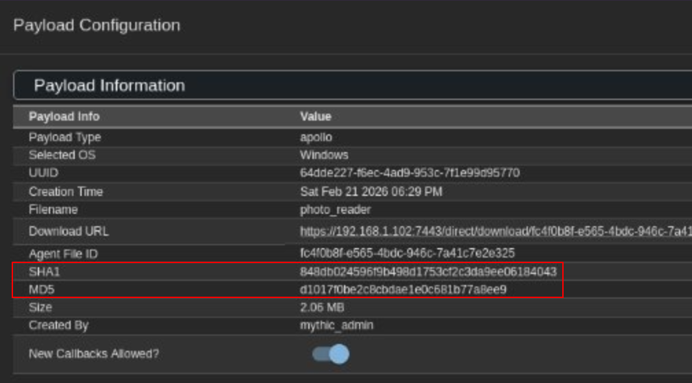

Here is a write-up of a team project I did for INF807 (Digital Forensics in IT Security), where we used Wireshark not as a network-troubleshooting tool, but as a forensics instrument: to prove that a piece of malware presented as evidence hadn't been tampered with in transit, and to reconstruct an attacker's actions even though the command-and-control channel was encrypted twice over.

<!-- markdownlint-capture -->
<!-- markdownlint-disable -->
> This blog was temporarily written by AI to test the visual radar. The handwritten blog will be available soon.
{.prompt-danger }
<!-- markdownlint-restore -->

<!-- markdownlint-capture -->
<!-- markdownlint-disable -->
> Everything below happens inside a fictional, closed lab built for the course. The "victim", the attacker infrastructure, and the malware are all ours, spun up for educational purposes. Nothing here targets a real person or system. Decrypting C2 traffic is a *defensive* and *forensic* skill, and that's the only lens this post uses it through.
{.prompt-warning }
<!-- markdownlint-restore -->

## The scenario 🎭

Our fictional group, Hackerz807, is a Canadian outfit that (officially) sells penetration testing and cybersecurity advice, with "discretion and confidentiality guaranteed." Behind the scenes, they run a centralized Mythic C2 console (v3.4.24) and a small zoo of agents, including Apollo and Poseidon.

For this engagement, the lab looks like this:

| Role | Machine | Details |
|---|---|---|
| Attacker (C2) | Kali Linux, `192.168.1.102` | Mythic server on HTTPS/TLS 1.2 (443), plus an HTTP delivery server on 8000 |
| Victim | Windows, `192.168.1.101` | Runs the payload `photo_reader.exe` (an Apollo agent) |
| Evidence | `INF807-Capture Mythic C2.pcapng` | Full packet capture of the whole exchange |

The whole story fits in one capture file: the victim downloads `photo_reader.exe` from the attacker's delivery server over plain HTTP, the agent phones home over HTTPS, and the operator starts issuing commands. Our job as forensic analysts is to make sense of all of it after the fact, starting from nothing but the `.pcapng` (and, later, what the RCMP seized off the server).

<!-- markdownlint-capture -->
<!-- markdownlint-disable -->
> Why Mythic? It isn't an academic toy. Team Cymru published a [case study](https://www.team-cymru.com/post/mythic-case-study-assessing-common-offensive-security-tools) on Mythic in 2022, and the framework (by SpecterOps, the same people behind BloodHound) has been associated with real threat activity such as *BazarLoader* and *UNC2165*. It's a realistic thing to have to analyze.
{.prompt-info }
<!-- markdownlint-restore -->

## Two questions a forensic analyst has to answer ❓

The project boiled down to two deceptively simple questions, both of which come straight out of how this evidence would be challenged in court:

1. **Integrity.** If we present `photo_reader.exe` as evidence, how do we *prove* it's the exact same file that travelled across the wire, that nobody (not even the investigators) altered it between the attacker's server and the victim?
2. **Reconstruction.** How do we retrace what the malware actually *did*, when the C2 channel is encrypted?

Wireshark answers both. Let's take them in order.

## Step 1: Carving the malware and proving its integrity 🧬

The delivery happens in the clear. A quick look at the HTTP requests shows the victim reaching out to the attacker's delivery server:

```
GET http://192.168.1.102:8000/photo_reader.exe
→ 200 OK   application/x-msdos-program   2,161,664 bytes
```

Because it's plain HTTP, Wireshark can reassemble the file directly out of the packets. Under File → Export Objects → HTTP, pick `photo_reader.exe` and save it. You now hold the exact bytes that crossed the network, with no need to ever touch the victim's disk.

Then comes the part that matters legally: hashing. Using something like *GtkHash* (or `certutil -hashfile`, or `sha1sum`), we fingerprint the carved file:

```
photo_reader.exe   (2,161,664 bytes, MZ executable)
MD5    d1017f0be2c8cbdae1e0c681b77a8ee9
SHA1   848db024596f9b498d1753cf2c3da9ee06184043
```

Now the punchline. Meanwhile, the RCMP had raided the Mythic server. The server-side payload configuration in Mythic records the hashes of every payload it generated:


{ caption="Mythic's own record of the payload it built. The SHA1 and MD5 here have to match the file we pulled off the wire, and the copy sitting on the victim's disk." }

The hashes recorded by the C2 server (`SHA1 848db02459…184043`, `MD5 d1017f0be2…a8ee9`) are byte-for-byte identical to the file I carved out of the capture. Do the same hash on the victim's copy, and it lines up too. Three independent sources (the attacker's server, the network capture, the victim's disk) agree on the same fingerprint.

That's the whole game. It means:

- the file is identified uniquely by its digest;
- its integrity is proven: it wasn't modified in transit, and just as importantly, it wasn't modified *by the investigators* after seizure;
- it can serve as digital evidence in the case file handed to the court, because the chain of custody holds.

<!-- markdownlint-capture -->
<!-- markdownlint-disable -->
> You never work on the original capture. The original is sealed and hashed to preserve the chain of custody; analysis is done on a working ("search") copy, and the expert report ships with a separate ("investigation") copy. If your analysis copy's hash ever drifts from the original's, your evidence is compromised, and so is your credibility on the stand.
{.prompt-warning }
<!-- markdownlint-restore -->

## Step 2: Decrypting the HTTPS/TLS layer 🔓

So far so good, but the interesting part, the actual command-and-control, runs over HTTPS on port 443. In the capture it's a wall of `Application Data` records: TCP conversation `192.168.1.101 ⇄ 192.168.1.102:443`, endless `POST /data` requests, endless `200 OK` responses, and not one readable byte.

Normally that's where an analyst gets stuck. But here's the forensic gift: the capture was taken on the server, and the server logged its TLS session keys. That's the `tlskeys.log` file, the standard `SSLKEYLOGFILE` format that records the secrets negotiated during each handshake:

```
CLIENT_RANDOM 6997b5a2c7ee8301…8152333e 043936fccc000751…9987bd7
CLIENT_HANDSHAKE_TRAFFIC_SECRET …
SERVER_HANDSHAKE_TRAFFIC_SECRET …
CLIENT_TRAFFIC_SECRET_0 …
SERVER_TRAFFIC_SECRET_0 …
```

Wireshark can use those keys to decrypt the session after the fact. Point it at the file:

Edit → Preferences → Protocols → TLS → *(Pre)-Master-Secret log filename* → `tlskeys.log`

The moment you apply it, the capture transforms. The TLS 1.2 handshake (around packets 7499 to 7504 in our capture) is still there, but everything after it stops being opaque `Application Data`. The `POST /data` bodies and their `200 OK` replies become fully readable HTTP.

<!-- markdownlint-capture -->
<!-- markdownlint-disable -->
> The key log holds secrets for several TLS sessions. The one that matters is the session whose `CLIENT_RANDOM` matches the C2 conversation, in our case the one ending in `…8152333e`. Wireshark sorts that out for you once the file is loaded; you just have to know which conversation you actually care about (`ip.addr == 192.168.1.102 && tls`).
{.prompt-tip }
<!-- markdownlint-restore -->

The "victim's" whole premise (*"the traffic is encrypted, the police will never find anything against us!"*) falls apart the instant those keys are on the table. But decrypting TLS only gets us halfway.

## Step 3: Peeling back the *second* layer (the Apollo/Mythic encryption) 🧅

Here's the twist that makes Mythic interesting. Even with TLS stripped away, the `POST /data` bodies are still not plaintext. They look like this:

```
NjRkZGUyMjctZjZlYy00YWQ5LTk1M2MtN2YxZTk5ZDk1Nzcw2K7p… (a long base64 blob)
```

That's because Mythic doesn't trust the transport. On top of TLS, every agent encrypts its messages with its own pre-shared AES-256 key, the *AESPSK*. TLS protects the tunnel; the AESPSK protects the message *inside* the tunnel. Strip one and the other is still there. This is exactly the kind of "encrypted even after you decrypt it" situation that trips up a first-time analyst.

Mythic's default scheme is `aes256_hmac`, and the wire format of each message is straightforward once you know it:

```
base64(  UUID (36 ASCII chars)  ||  IV (16 bytes)  ||  AES-256-CBC ciphertext  ||  HMAC-SHA256 (32 bytes)  )
```

The same 32-byte key (the base64-decoded AESPSK) is used both to AES-256-CBC decrypt the body and to verify the HMAC over `IV || ciphertext`. And the AESPSK is one of the things the RCMP recovered from the seized server:

```
AESPSK (aes256_hmac):  pYMtx7Bc2UMHE2jL7NnHRSDaL3IaPcyCF2oGuIbVVc8=
```

To turn that format into readable JSON I wrote a small decryptor. Keeping with Mythic's habit of naming its pieces after Greek gods (Apollo, Poseidon, Medusa…), I called mine Poseidon. It takes the hex bytes Wireshark shows for a message body and walks them back to plaintext (`hex → base64 → AES-CBC → JSON`). The output is a little messy (one-line, escaped JSON) but entirely manageable:

```python
import base64, hmac, hashlib, json
from Crypto.Cipher import AES

KEY = base64.b64decode("pYMtx7Bc2UMHE2jL7NnHRSDaL3IaPcyCF2oGuIbVVc8=")  # 32 bytes

def poseidon(hex_body: str) -> dict:
    msg  = base64.b64decode(bytes.fromhex(hex_body))   # UUID(36) + IV(16) + ct + HMAC(32)
    uuid, blob = msg[:36].decode(), msg[36:]
    iv, ct, mac = blob[:16], blob[16:-32], blob[-32:]
    assert hmac.compare_digest(hmac.new(KEY, iv + ct, hashlib.sha256).digest(), mac), "bad HMAC"
    pt = AES.new(KEY, AES.MODE_CBC, iv).decrypt(ct)
    return uuid, json.loads(pt[:-pt[-1]])              # strip PKCS7 padding
```

Feed it the body of `POST /data` (copy it out of Wireshark as hex, or automate the extraction with `tshark -T fields -e http.file_data`), and the C2 conversation finally speaks.

<!-- markdownlint-capture -->
<!-- markdownlint-disable -->
> The HMAC check isn't decoration. If it validates, you've *proven*, cryptographically, that the message was produced by something holding that exact key, and that not a single byte was altered afterward. That's a strong forensic statement to be able to make about a piece of encrypted evidence.
{.prompt-info }
<!-- markdownlint-restore -->

## Replaying the attack from the decrypted stream 🎬

With both layers off, the capture reads like a transcript. Here's the actual sequence, straight out of our `.pcapng`.

The first check-in is the agent introducing itself to the C2. Notice it's signed with the *payload* UUID (`64dde227-…`), the same one from the screenshot above:

```json
{
  "action": "checkin",
  "uuid": "64dde227-f6ec-4ad9-953c-7f1e99d95770",
  "host": "DESKTOP-GUFPUCS",
  "user": "WINDOWS-PC",
  "domain": "DESKTOP-GUFPUCS",
  "os": "Windows 10 Education 2009 6.2.9200.0",
  "architecture": "x64",
  "pid": 6728,
  "process_name": "photo_reader",
  "cwd": "C:\\Users\\WINDOWS-PC\\Downloads",
  "ips": ["192.168.1.101", "fe80::484a:dd16:6f56:ee54%12"]
}
```

The server acknowledges and hands the agent a new callback UUID for the rest of the session:

```json
{ "action": "checkin", "status": "success", "id": "3e8ead26-f4fa-4c6e-8024-6018792dbb08" }
```

From here on, every message the agent sends is signed with `3e8ead26-…` instead. The agent then settles into a polling loop (`get_tasking` with empty task lists) until the operator types something. When they do, the reply to a poll stops being empty:

```json
{ "action": "get_tasking",
  "tasks": [ { "command": "whoami", "parameters": "", "id": "17896512-…" } ] }
```

…and moments later the agent posts the result back:

```json
{ "user_output": "Local Identity: DESKTOP-GUFPUCS\\WINDOWS-PC\nImpersonation Identity: DESKTOP-GUFPUCS\\WINDOWS-PC" }
```

Keep pulling the thread and the operator's whole session unspools. A few real examples from our capture:

- `whoami` → `DESKTOP-GUFPUCS\WINDOWS-PC`
- `ifconfig` → adapter `Ethernet0`, `192.168.1.101`, *Intel(R) 82574L Gigabit Network Connection*, gateway `192.168.1.1`
- `ls` (path `.`) → a full directory listing of `C:\Users\WINDOWS-PC\Downloads`, including a suspicious `camera-catalogue (1).exe` weighing in at exactly `2,161,664` bytes, the same size as our payload.

That last one is the moment the story closes on itself: the file browser output, recovered from doubly-encrypted traffic, points right back at another copy of the malware sitting in the victim's Downloads folder. We reconstructed *what the attacker saw and did*, minute by minute, from a stream that was supposed to be unreadable.

<!-- markdownlint-capture -->
<!-- markdownlint-disable -->
> Want a spoiler on the neatest detail? ||The very first message is encrypted with the payload UUID because the agent doesn't have a session identity yet, and the callback UUID only exists after a successful check-in. If you try to decrypt the whole stream with a single UUID, the first packet fails and everyone panics. The UUID literally changes mid-conversation, and the capture shows the exact handoff.||
{.prompt-tip }
<!-- markdownlint-restore -->

## When Wireshark shows up in a real courtroom: *R. v. Hughes* ⚖️

All of this raises a fair question: does any of this actually hold up in court? It does, and there's a Canadian case that makes the point beautifully: **_R. v. Hughes_, [2022 ONSC 5209](https://canlii.ca/t/jxfkv).**

The facts, briefly. In July 2017, the U.S. *Internet Crimes Against Children* (ICAC) Joint Task Force alerted the Ontario Provincial Police that an Ontario IP address on BitTorrent was tied to child sexual abuse material (par. 3). An OPP investigator used a law-enforcement tool called Torrential Downpour (TD) to connect to that IP and download the flagged files (par. 4). A search warrant followed, the accused's computer was seized with the same files on it, and Mr. Hughes was charged under s. 163.1 of the Criminal Code with possession and making available.

Here's where it gets relevant to our project: Torrential Downpour is, in a very real sense, a command-and-control tool too, a controller that reaches out to a remote host and pulls specific data back, exactly the pattern we just dissected with Mythic. And the defence did what any good defence does: it asked for the source code of TD and its receptor module TDR (tools handed to police for free through the *ICACCOPS* system, par. 6, 38) to test whether the tool did anything it shouldn't have. The Crown refused, invoking investigative-technique privilege (par. 7).

So how do you prove the tool behaved, without handing over its source code? You watch it work with Wireshark. Giuseppe Versace, an OPP project lead in the Child Sexual Exploitation Unit, designed a validation protocol: three tests, run on 9 June 2022 across two virtual machines (par. 64–65), with Wireshark capturing everything the tool did on the wire. The captures confirmed two things that were central to the case: that TD leaves no artifact on the target, and downloads only the file it's aiming at, nothing more.

The court's resolution is the part worth remembering:

- The source code stays privileged: it's a protected investigative technique, and disclosure was refused (par. 236).
- But the analytical results must be disclosed to the defence: the TD/TDR manuals (par. 14a), thousands of pages of interaction logs, the accused's device (par. 76), and crucially the validation reports, including the Wireshark packet captures (par. 240).

In other words, the packet capture became the bridge between "trust our secret tool" and "here's independently verifiable evidence of exactly what it did." That's Wireshark doing precisely the forensic job we did in the lab, proving from the network up what a piece of software really does, except with someone's liberty on the line.

## Conclusion 🧭

Wireshark was built in 1997 to troubleshoot networks. A quarter-century on, it's a legitimate forensic instrument, and this project let us exercise three faces of it at once:

- **Integrity**: carve a malware sample straight out of a capture and prove, by hash, that it's identical to the seized original and to the victim's copy.
- **Analysis through encryption**: strip TLS with logged session keys, then strip Mythic's own AES-256 layer with the recovered PSK, to turn an opaque stream into a full transcript of the attacker's commands.
- **Judicial weight**: as *R. v. Hughes* shows, a Wireshark capture can be the disclosable, independently verifiable evidence that lets a court trust a secret tool without exposing it.

The single most useful lesson? Decrypting TLS is not the finish line. Modern C2 frameworks assume the tunnel will be broken and encrypt again underneath it. The analyst who stops at the first layer sees base64 noise and concludes there's nothing there; the one who knows to look for the second layer, and has the key, reconstructs the entire crime.

## Appendix: Wireshark filters that earned their keep 🧰

| Goal | Filter |
|---|---|
| Spot C2 beacons (data going *to* the server) | `http.request.method == "POST"` |
| Isolate all traffic with the C2 host | `ip.addr == 192.168.1.102 && http` |
| See every TLS *Client Hello* | `tls.handshake.type == 1` |
| Keep only TLS 1.2 | `tls.handshake.extensions.supported_version == 0x0303` |
| Hunt suspicious DNS | `dns.qry.name contains "suspicious"` |
| Catch large exfil transfers | `tcp.len > 1000 && ip.dst == 192.168.1.102` |
| Window the incident in time | `frame.time >= "2026-02-21 06:00:00"` |

## TL;DR 🎯

- Pulled `photo_reader.exe` (a Mythic Apollo agent) out of a `.pcapng` and proved by MD5/SHA1 that the wire copy, the seized-server copy, and the victim's copy are the same file (chain of custody intact).
- Decrypted the HTTPS/TLS 1.2 C2 with the server's logged session keys (`SSLKEYLOGFILE` → *(Pre)-Master-Secret log filename*).
- Peeled the second layer (Mythic's `aes256_hmac` AESPSK) with a short Python decryptor, recovering the check-in and a full command history (`whoami`, `ifconfig`, `ls`).
- *R. v. Hughes* (2022 ONSC 5209) shows the same technique in a real courtroom: Wireshark validated a secret police C2-style tool without disclosing its source code.
- Big takeaway: breaking TLS is step one, not the whole job. Expect a second layer of encryption underneath.

Want to try it yourself? We built a private room for it on TryHackMe: [INF807 – Groupe E – Wireshark](https://tryhackme.com/room/inf807groupeewireshark).

Thanks for reading. If you take one habit away from this, let it be the reflex to ask *"and what's under the encryption I just removed?"* That's the difference between "the traffic was encrypted" and a full reconstruction of the attack.
